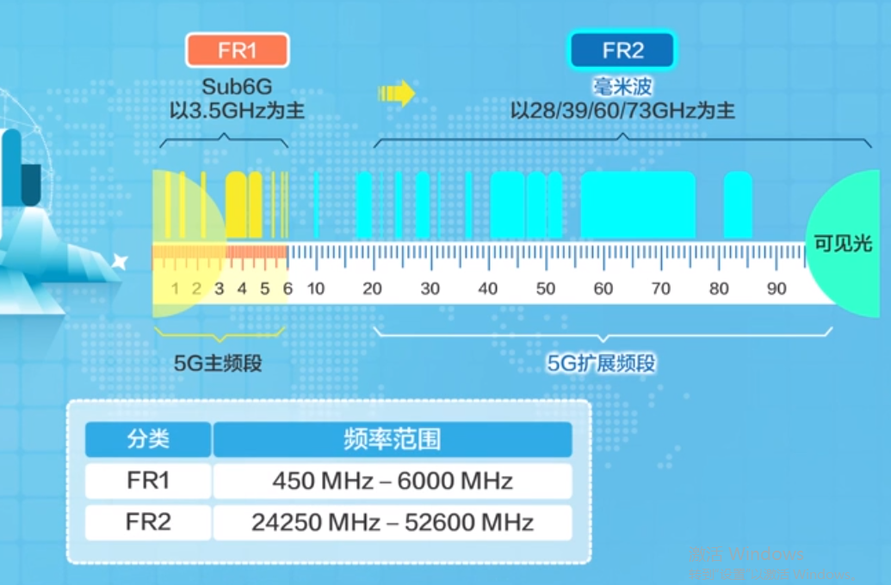

**移动通信论坛**：有很多资料下载
**5G协议下载**：<http://www.3gpp.org/ftp/Specs/archive/38_series/>  
**相关分享，主要3GPP协议相关的**：<http://sharetechnote.com/>  
**业务层中文资料**:<https://marshallcomm.cn/categories/5G-NR/>  
**咨询论坛**:<http://rf.eefocus.com/module/forum/forum.php?mod=collection&action=view&ctid=1>  
## 一、SOC介绍
### 1.1 SOC定义
&emsp;**Soc定义**：System on Chip的缩写，一般叫作系统级芯片。也有称片上系统，意指它是一个产品，是一个有专用目标的集成电路，其中包含完整系统并有嵌入软件的全部内容。同时它又是一种技术，用以实现从确定系统功能开始，到软/硬件划分，并完成设计的整个过程。从狭义角度来讲，它是信息系统核心的芯片集成，是将系统关键部件集成在一块芯片上；从广义角度讲，Soc是一个微小型系统，国外一般倾向将Soc定义为将微处理器、模拟IP核、数字IP核和存储器（或片外存储控制接口）集成在单一芯片上，它通常是客户定制的，或是面向特定用途的标准产品。
### 1.2 SOC的基本内容

&emsp;**Soc构成**：如Fig 1所示
* 系统级芯片控制逻辑模块
* 微处理器/微控制器CPU 内核模块
* 数字信号处理器DSP模块
* 嵌入的存储器模块
* 和外部进行通讯的接口模块
* 含有ADC /DAC 的模拟前端模块
* 电源提供和功耗管理模块
* 射频前端模块（无线Soc）
* 用户定义逻辑(它可以由FPGA 或ASIC实现)（无线Soc）
* 微电子机械模块（无线Soc）
* 基本软件(RDOS或COS以及其他应用软件)模块
&emsp;**Soc生产过程**：
* 基于单片集成系统的软硬件协同设计和验证;
* 再利用逻辑面积技术使用和产能占有比例有效提高即开发和研究IP核生成及复用技术，特别是大容量的存储模块嵌入的重复应用等;
* 超深亚微米(VDSM) 、纳米集成电路的设计理论和技术。
&emsp;**Soc设计的关键技术**：SoC关键技术主要包括总线架构技术、IP核可复用技术、软硬件协同设计技术、SoC验证技术、可测性设计技术、低功耗设计技术、超深亚微米电路实现技术。**目前SoC**更多的是对处理器（包括CPU、DSP）、存储器、各种接口控制模块、各种互联总线的集成，其典型代表为手机芯片（参见术语“终端芯片”的介绍）。SoC有两个显著的特点，一是基于IP设计模式；二是软件比重大。
&emsp;**设计重用技术**：数百万门规模的系统级芯片设计，不能一切从头开始，要将设计建立在较高的层次上。需要更多地采用**IP复用技术**，只有这样，才能较快地完成设计，保证设计成功，得到价格低的 SoC，满足市场需求。
&emsp;设计再利用是建立在芯核(CORE)基础上的，它是将己经验证的各种超级宏单元模块电路制成芯核，以便以后的设计利用。芯核通常分为三种，一种称为**硬核**，具有和特定工艺相连系的物理版图，己被投片测试验证。可被新设计作为特定的功能模块直接调用。第二种是**软核**，是用硬件描述语言或C语言写成，用于功能仿真。第三种是**固核**(firm core)，是在软核的基础上开发的，是一种可综合的并带有布局规划的软核。设计时候复用方法在很大程度上要依靠固核，将RTL级描述结合具体标准单元库进行逻辑综合优化，形成门级网表，再通过布局布线工具最终形成设计所需的硬核。这种软的RTL综合方法提供一些设计灵活性，可以结合具体应用，适当修改描述，并重新验证，满足具体应用要求。另外随着工艺技术的发展，也可利用新的库重新综合优化、布局布线、重新验证以获得新工艺条件下的硬核。用这种方法实现设计再利用和传统的模块设计方法相比其效率可以提高2－3倍，因此，0.35um工艺以前的设计再利用多用这种RTL软核
### 1.3 IP内核
&emsp;**定义**：IP核（Intellectual Property core知识产权核）是一段具有特定电路功能的硬件描述语言程序，该程序与集成电路工艺无关，可以移植到不同的半导体工艺中去生产集成电路芯片。
&emsp;IP（知识产权）核将一些在数字电路中常用，但比较复杂的功能块，如FIR滤波器、SDRAM控制器、PCI接口等设计成可修改参数的模块。IP核的重用是设计人员赢得迅速上市时间的主要策略。随着CPLD/FPGA的规模越来越大，设计越来越复杂（IC的复杂度以每年55%的速率递增，而设计能力每年仅提高21%），设计者的主要任务是在规定的时间周期内完成复杂的设计。调用IP核能避免重复劳动，大大减轻工程师的负担，因此使用IP核是一个发展趋势。

## 二 移动通信进化论（华为课程学习）
#### 前言：课程目标
* 5G应用场景与业务类型
* 5G指定标准与协议版本
* 独立组网、非独立组网技术
* 关键无线技术

### 1. 移动通信业务的主要挑战
4G的业务不能支持? 
超高清视频（4K、8K）、AR/VR、车联网等 
1.1 5G面临的挑战
* **大流量**。移动带宽数据量呈现爆发式增长。比如下载一部8GB的高清电影，使用14Mbps的3G网络需要70分钟才能下载完成，使用150Mbps的4G网络则需要7分钟。如果能使用10Gbps的5G网络，就只要6s时间。
* **大连接**。随着智慧城市与物联网的发展，未来不仅是人与人之间的连接，更多的是人与物、物与物之间的连接。水表、路灯、家电等都可以介入网络中，3G(每小区支持100个连接)以及4G(每小区支持1000个连接)不足以支持万物互联的需要。而5G每平方公里支持100万个连接，大大增加了可连接数量。
* **多场景**。基于车联网的全自动驾驶，需要车与路之间的高速协调，这对时延要求非常高。4G网路的时延小于50ms，相当于3G网络的一半。而5G可以达到1ms的超低时延。
### 2. 5G的定义
ITU-R定义了未来5G的三大类应用场景，如下图所示： 
  
* 增强型移动互联网业务。eMBB (Enhanced Mobile Broadband)
* 海量连接的物联网业务。 mMTC （Massive Machine Type Communication)
* 超高可靠性与超低时延业务。 uRLLC （Ultra Reliable & Low Latency Communication)

#### 2.1 5G由来
* 2012年。国际电信联盟(ITU)组织全球业界展开了5G愿景和技术趋势的研究。
* 2015年。无线电通信全会在瑞士日内瓦召开，国际电联无线电通信部门 (ITU-R) 正式批准了推进未来5G研究进程的决议，并正式确定了5G的法定名称是"IMT-2020",历经两年，ITU的5G愿景主体研究工作已基本完成。5G定位于未来的全世界连接，做到“信息随心至，万物触手及”，5G是一个端到端的、全移动的、全连接的生态系统。

#### 2.2 5G的性能要求
* 吞吐率。10Gbps
* 时延。1ms超低时延
* 连接密度。每平方公里100万连接数

#### 2.3 三大场景如何影响人们生活
* eMBB。可以随时随地的高速接入网络，享受VR和AR等新业务，还可以随时随地通过5G网络分享你看到的一切。
* mMTC。使得参与整个社会运行的万事万物具备了可感知的能力，让我们的个人可穿戴设备、智慧家庭设备以及智慧城市设备都恶意轻松接入网络，给用户提供定制化的服务。
* uRLLC场景。可以体验到远程医疗以及自动驾驶带来的便捷，让智能工业制造成为现实。智能驾驶以及智能制造都是5G在关键垂直行业的重要应用。

### 3. 5G协议标准化及进展
&emsp;2017年底冻结的R15协议版本中，主要聚焦eMBB，而uRLLC及mMTC会在后续版本进一步研究。 
  
组网：
* 非独立组网 (NSA): 4G基站(eNB)和5G基站(gNB)共用4G核心网(EPC)，eNB为主站，gNB为从站，控制信令走4G通道至EPC。
* 独立组网 (SA)：基站为5G基站(gNB)，核心网为5G核心网(NG)。

#### 3.1 什么是通信技术标准？
&emsp;通信技术标准是指通信生产、通信建设以及一切通信活动中共同遵守的技术规定。如果通信标准不一样，那么不同设备将无法进行通信 
**通信标准的重要性**：3G时代，美国高通公司掌握了较多的CDMA(码分多址)关键技术，并且积极推动这些技术形成标准，并申请全球专利，其它通信公司开发3G产品（包括核心网设备 基站 手机）都需要遵从3G标准，所以都需要向高通公司交一笔不菲的专利费。 
**ITU和3GPP组织**  
* ITU。ITU负责定义5G愿景和网络关键能力指标，指定5G网络需求。
* 3GPP。3GPP负责具体的标准化工作，指定并发布技术规范和技术报告。联合各大设备厂商以及通信运营商共同指定具体的5G协议标准。3GPP的标准演进工作是以GSM为基础进行的。成功实现了从2G到3G 4G和4.5G的演进。随影协议版本也从R99演进到R13和R14。

#### 3.2 5G协议版本
&emsp;5G的协议版本将从3GPP Release15开始。为了保护通信运营商公司原有的LTE投资，5G会包含两部分，分别是LTE的演进(eLTE)以及5G新空口(NR)，这两部分都会在Release 15和Release 16协议中定义。在5G商用之前，eLTE将会成为5G的重要补充。 
**两个阶段**   
* 阶段一：推出Rel-15，主要定义eMBB业务场景，已经于2018年6月冻结协议。为了阻止非国际组织OTSA破坏5G全球标准的指定，3GPP于2017年2月的巴展期间启动了5G标准的加速，将5G的阶段一又细分为两个部分阶段1.1以及阶段1.2分别对应非独立组网NSA和对组网SA场景。阶段1.1在2017年12月份冻结，该版本不能独立组网需要和4G配合使用，便于激进的公司快速部署5G业务。而阶段1.2于2018年6月协议冻结。至此，OTSA被瓦解。
* 阶段二：推出Rel-16，主要定义mMTC以及uRLLC两个业务场景。计划于2019年底协议冻结。

### 4. 5G网络架构与全云化趋势
&emsp;**网络架构云化演进**。分别在核心网引入网络功能虚拟化（NFV）技术、在无线接入网引入云化无线接入网（Cloud RAN）以及在传输网引入软件定义网络（SDN）。重配5G网络架构，灵活适配5G网络的各种业务场景和需求。  
  
**新需求-灵活适配客户差异化的业务场景和需求**  
* 消费者终端业务。5G网络需要支持多种业务场景差异化QoS。
* 垂直行业。不同的垂直行业需要安全性的保证，5G网络各业务之间需要良好的隔离性。
* 网络运营商。易于部署和运维，并进一步实现基于互联网架构的自动化运维和运营。所以5G网络还需要具有统一性和开放性。

注：要实现这些功能，5G必须实现云化，导致基于云的网络架构应运而生。 
**移动通信网络架构**   
  
* 无线接入网络。实现网络接入。gNodeB(5G基站)分别同股票NG-C和NG-U接口对接核心网的控制面和用户面。5G的无线网络简称NG-RAN只有基站一种设备，基站通过Xn接口互联。而5G终端通过新的空中接口NR（New Radio）接入5G网络。
* 传输网络。用于网络传输，简称IP Backhaul，主要负责传输无线和核心网交互的数据
* 核心网络（Next Generation Core, NGC）。网络控制，主要包括控制面和用户转发平面。

&emsp;要实现全运化，需要分别在核心网到无线网络引入网络功能虚拟化(Network Function Virtualization, NFV)、软件定义网络(Software Defined Network, SDN)以及云化无线接入网(Cloud Radio Access Network, Cloud RAN)等技术 
  

**核心网NFV**   
&emsp;传统核心网采用**烟囱式结构**，个厂商采用专用硬件，成本高，资源无法共享，同时软硬件合一导致扩容复杂，新业务部署周期长 
  
&emsp;5G网络要求时限多场景业务的灵活部署，不同垂直用户行业用户对于端对端网络资源的差异化逻辑切分都是目前烟囱式结构无法解决的。所以核心网云化是必由之路。 
* 支持多样的业务需求
* 新业务敏捷上线
* 提升资源利用率
* 降低网络运营商的设备采购成本

  
&emsp;通过虚拟化技术把网络设备的软件与硬件解耦，设备功能以软件形式部署在同一通用的基础设施上（通用计算、存储、网络设备）。 

**无线接入网 Cloud RAN**   
&emsp;由于NFV技术的使能，无线网络进入全面云化时代，无线网络需要完成高频模拟信号的处理，同时无线信号又是随时间快速变化的。5G时代，无线基站将分为两部分：
  
* CU集中单元（Centralized baseband units）。处理对时延不敏感的基带数字信号，同时在CU部分实现云化。并且实现控制面信令CP和用户面数据UP的分离
* DU分布式单元（Distributed radio Units）。处理对时延敏感的射频信号。

&emsp;CU和DU通过F1接口实现传输互通，基于CU和DU分离的思想，华为提出Cloud RAN解决方案。CU部分使用华为通用x86架构服务器E9000，提高工5G基站的非实时基带数据处理并且基于虚拟化技术可以灵活支持多种业务以及网络切片。DU部分适配各种覆盖和安装场景，提供宏基站、微站以及室内分布式产品完成实时的信号处理。 
&emsp;基于Cloud RAN方案，实现按需部署、智能切片、适配多样性业务，适应大带宽、短时延、超多连接等业务，同时实现资源池化，提升资源利用效率，网络弹性扩容。

**网络传输 SDN**
&emsp;随着IT技术的不断发展，传统的大型软硬件一体化组件演化到今天的硬件-操作系统-应用的分层结构。在IP传送网络上SDN也在做同样的事情，把网络分层、虚拟化，更重要的是让它越来越简单。 
  
&emsp;SDN的核心思想是：“控制和转发分离”，”软件应用灵活、可编程”，正由于PC以及手机领域的变革，也必将在IP传输网络领域掀起更大风暴。IP传输网络云化的原因不同于核心网和无线网，它是由技术驱动的。SDN的本质是给网络构建一个集中的大脑，通过全局视图和集中控制，实现全局流量和整体最优，是网络架构的变革。 
  
&emsp;SDN的核心技术是将网络设备的控制面与数据面分离开，从而实现网络流量的灵活控制，为网络及应用的创新提供良好的平台。SDN网络基于几种控制可以简化运维，实现自动化调度，提高网络利用率。通过API接口，提供网络开放能力，大幅降低业务部署上线时间，为5G网络的各种业务场景提供基于差异化的QoS的IP传输网络切片能力。 
  
&emsp;**总而言之**，5G网络将应云而生。基于同一个物理网络采用云计算技术按需定义网络资源，快速实现基于业务QoS的网络切片Slicing，在保证安全隔离的前提下支持各种垂直行业的应用。 
### 5. 5G网络切片
#### 前言
&emsp;网络切片的时候，无线网络主要是切分时频资源，传输网络主要是切分带宽资源，核心网主要是切分网元功能，并且基于不同业务需求，实现灵活地理位置布放。 
  
#### 什么是网络切片？
&emsp; 网络切片是指无线网到传输网再到核心网，通过切片技术把一张物理的5G网络切分成多张端到端的逻辑网络，不同的逻辑网络（切片）承载不同的业务。通过网络切片可以高效灵活部署各种差异性需求业务网络；并进行切片隔离从而保证业务的高质量；还可以使得运营商有机会进入垂直行业市场拓展服务领域；还可以以最低成本，提供差异化服务，降低网络建设成本。
#### 如何实现网络切片？
**无线网切片**  
&emsp;无线网最宝贵的资源是“时频资源”。按照切分思想，分为硬切和软切。硬切就是划分固定资源用于各个场景，互不干涉，这种是不可能应用的，太浪费时频资源了。软切就是预留一些重要时频资源外，其它资源都可以根据需求灵活分配。 
**传输网络切分** 
&emsp;传输网络最宝贵的资源是”带宽资源”。传输网络中会运用“FleXETH”或者”ODUK“等技术对链路带宽资源进行切分。传输网络不通切片之间带宽资源不是共享的，但切片内部的不同业务是共享整个切片带宽的。这样可以保证切片资源更有效的利用。
**核心网切片** 
&emsp;核心网是基于NFV技术的，所有网元功能都将以软件的形式存在服务器中，除此之外就是功能模块化，每个网元只干一样事情。

### 6. 5G组网方案
#### 前言
&emsp;5G组网分为非独立组网（non-Standalone）与独立组网（Standalone） 
  
我们把当前协议支持的各种组网类型做了一个归类。如下图所示: 
  
5G独立组网所需条件： 
* 必须部署5G核心网（NGC）
* 5G核心网（NGC）直接向5G基站（NR）下发控制信令

#### NSA组网
&emsp;典型的NSA组网-Option3系列如图15所示。不难发现三种组网模式相同点是核心网络都是EPC，无线侧都是LTE+NR，而且信令面都是锚定在LTE侧。 
  
&emsp;但仔细看三种方式还是有区别的，主要体现在用户面数据在哪里分流的。**Options3**中用户面流量分流点位于LTE基站侧，这种分流方式属于动态分流，能够根据LTE基站和NR基站信号的好坏动态决定分流比例，但这种方式会造成对现网存量LTE站点造成很大的传输压力，需要对存量LTE站点做大规模升级改造；**Option3a**用户面分流点位于EPC侧，这种分流方式属于静态分流，也就是不论LTE基站和NR基站信号的好坏都按照固定比例分流最终对用户的业务感知造成影响；**Option3x**，用户面流量分流点位于NR基站侧，这种同样属于动态分流方式，但是该方式不会对现网存量LTE站点造成很大的传输压力，所以不许呀对存量站点做大规模升级改造，这是目前5G实验网首选方案。  
  
&emsp;我们再看一下**Option7**系列，如图16所示。跟Option3的区别就在于核心网，其它完全一样。由于控制面信令同样锚定在LTE侧，所以Option7系列依旧是NSA组网。

#### SA组网-Option4和Option2
  
&emsp;Option4系列包括Option4和Option4a两种组网模式。从图中可以看出，三种组网模式相同点是核心网络都是NGC，无线侧都有NR，而且信令面都锚定在NR侧。三种组网的区别在于用户面业务数据在哪里分流。 
* Option4中用户面分流点位于NR基站侧，属于动态分流，也不会对现网存量LTE站点造成很大的传输压力，不需要对存量站点做大规模升级改造。
* Option4a用户面流量分流点位于NGC侧，属于静态分流，不论LTE基站和NR基站信号的好坏都按照固定比例分流，对用户业务感知造成影响。
* Option2这种组网非常简单，核心网是NGC，无线侧只有NR，不存在业务分流的情况，这种组网方式是今后5G网络的目标组网架构

&emsp;以上三种组网方案由于信令面都锚定在NR侧，相对于NSA来说，对NR的覆盖面要求更高 

#### 组网演进路线
  
&emsp;上图战士了两条不同的组网演进路线，两条路线的起点都是LTE网络架构。终点都是Option2架构，两条路线演进路线区别如下： 
* 路线1。首先由LTE架构演进到Option3x，再由Option3x直接跳到了Option4，最后演进到Option2。该路线适合NR覆盖好的运营商
* 路线2。首先由LTE架构演进到Option3x，在刀Option7x，最后到Option4或者Option2。该路线适合NR覆盖不好的运营商。

### 7. 5G空口关键技术
#### 前言
&emsp;相较于4G，5G在空中接口上应用的技术进一步增强。本节内容主要针对5G的覆盖性能、速率及时延介绍了5G空口的几个关键技术，包括：上下行解耦、新编码技术、Massive MIMO、免授权调度及D2D技术。 
&emsp;由于冻结的Rel-15中还没有mMTC场景标准还没有定义，用于增大系统连接数的关键技术还没有最终冻结，所以本章节介绍其它三大类关键技术：
* 覆盖增强技术
* 速率提升技术
* 时延降低技术

#### 覆盖提升技术
&emsp;根据香农公式可以得知，信道容量C要想提高，最直接的方法是增加带宽B，(S/N是信噪比)。    
C=B*log2(1+S/N)    
而5G最大带宽将会达到1GHz，考虑到目前频率占用情况，5g今后将不得不适用高频进行通信，高频通信相对于低频有两大挑战：
  
* 高频信号相比于低频传播损耗更大，绕射能力弱，如图19所示，可以看出同样距离条件下高频信号的传播路损远高于低频信号。也就是高频信号的小区覆盖半径将大幅衰减。
* 上下行覆盖不均衡。而且频段越高，上下行覆盖差异越明显。导致上行覆盖受限。如图20所示，由于几张的发射功率远远大于手机发射功率，导致基站的上行业务信道PUSCH覆盖远小于下行信道。从而造成手机在小区边缘位置发信号给基站，基站根本接受不到。

&emsp;针对上面两个问题，华为提出了上下行解耦的解决方案，NR中基站下行使用高频段进行通信，上行可以根据UE覆盖选择与LTE共享低频资源进行通信。

#### 速率提升技术
&emsp;5G速率能比4G提升那么多，很多技术是分不开的。比如新编码技术以及Massive MIMO技术。 
**新编码技术** 
&emsp;编码就是通过添加荣誉信息来保护有用信息，提升信息传递的可靠性。根据最新冻结的1R15协议版本，5G的eMBB场景中，控制信道采用的四皇Polar编码，业务信道采用的是LDPC编码，相对于4G使用的Turbo编码技术存在很多优势，见图20所示： 
  
而Polar相对于Turbo，同样信噪比下Polar拥有更低的误码率，除此之外LDPC和Polar都拥有很高的编码效率。 
**Massive MIMO技术** 
&emsp;Massive MIMO是大规模天线阵列的意思。常见天线数量可以达到64根，实现64T64R。实际上它是一种实现三维波束赋形和多用户资源复用，提升覆盖能力和系统容量的大规模阵列天线方案。相对于4G里面传统的8T8R天线，Massive MIMO拥有更多的数据流，还能实现3D立体波束赋形。传统的8T8R下行只有4个波束，而64T64R的Massive MIMO由于波束更窄，下行可以达到16个流，意味着同一时刻，基站可以把相同的时频域资源分配给16个不同的用户使用，从而大幅提高小区的整体容量。除此之外，Massive MIMO还可以实现3D立体覆盖（水平波束和垂直波束），能够大幅改善高层居民小区、高层酒店的信号覆盖。

#### 时延降低技术
**免授权调度技术** 
&emsp;正常情况下，手机要发送信息给基站的时候，需要现象基站发送调度请求，基站再给手机发送调度授权，最后手机才能把需要发送的信息通过基站授权的资源块发送给基站。如果使用**免授权调度**的话，手机要发送信息给基站的时候，不需要发送调度申请，它可以直接把需要发送的信息通过预先预留的资源块发送给基站。也就是少了申请和授权的流程，从而达到降低空口时延的效果，目前这个技术预计会在R16中冻结，主要用于对时延敏感的uRLLC场景。 
**D2D技术**
&emsp;D2D全称叫Device to Device，也就是所谓的设备跟设备直接通信。常见的D2D应用有手机蓝牙、WIFI-Direct以及对讲机等。但是这里所讲的D2D是指通过基站分配频谱，用于终端与终端直接互联进行用户面数据传输的一种技术，这个技术主要有以下几方面的有点：
* 传输距离远。最远可以达到1公里以上。
* 传输时延小。D2D技术不需要经过基站中转，两个手机可以直接互通，缩短了传输距离。
* 频谱效率高。由于D2D终端用得频谱资源是复用小区的频谱资源，所以可以提升小区的频谱使用效率

由此可见D2D也是一种降低时延的技术，该技术预计将在R16版本中冻结。 

### 8. 5G频谱规划与选择
#### 前言
5G 支持全频谱接入：新频谱C波段和毫米波，存量频谱Sub3GHz均可用于5G
  

#### 频谱资源往高频发展
&emsp;在已经冻结的3GPP R15协议中，5G的总体频谱可以分为以下两个FR，FR1和Fr2。 
  
**FR1**（450MHz-6000MHz)是Sub6G频段，也是我们说的低频频段，是5G的主用频段。其中3GHz以下的频率我们称之为Sub3G，其余频段称为C-band。 
**FR2**(24250MHz-52600MHz)是毫米波，也就是我们说的高频频段，是5G的扩展频段，频谱资源丰富。 
考虑到FR1和FR2频段上的频率资源不同，3GPP协议规定不同频段范围支持不同的载波带宽。频段规划如下表所示.今后在R16版本中毫米波有可能还会出现800M的载波带宽。此外相对于4G而言，5G取消了1.4M和3M载波带宽，这主要是考虑到大带宽是5G的主要特征 

Sub6G | mmWave
- | -
5M | 50M
10M | 100M
15M | 150M
20M | 200M
40M | 400M
50M | -
60M | -
80M | -
100M | -

#### 全球5G频谱资源分配情况
  
&emsp;波段分配情况如上图所示。中国在c-Band和毫米波都分配了两段资源，毫米波资源很丰富。C-Band波段可用资源要少很多，但是也可以提供连续200MHz的频谱资源，今后也会成为5G的主要工作频段。 

#### 5G部署方案
&emsp;如果以后的2G，3G以及4G退网的话，Sub3G同样可以用来部署5G。所以今后Sub3G、C-Band以及毫米波都会用于部署5G。但是不会同时部署，因为不同波段的性质不同：  
* 毫米波将聚焦在话务热点区域，比如火车站、机场、移动回传等场景。射频器件性能要求高
* C-Band将聚焦城区广覆盖，相对于毫米波和Sub3G，C-Band兼顾了小区容量和覆盖。上下行覆盖能力较差，不平衡问题较明显。
* Sub3G的频谱资源，由于低频覆盖效果最佳，将聚焦在郊区和农村的广覆盖。暂时不考虑，等2,3,4G退网后，采用refarming技术，用于部署5G。

## 三 移动通信进化论（华为课程学习）
### 1. WDM原理
#### 1.1 波分复用
##### 1.1.1 如何增加网络容量
**增加网络容量常见的方法**：
* SDM。空分复用。通过铺设新的光缆，来提升网络容量。这种方法会花费比较多的时间和成本。
* TDM。时分复用。主要是提高比特速率。从STM-16(2.5G)到STM-64(10G)。成本和复杂度也是比较高的。使用最多的一种方案。
* WDM。波分复用。经济、快速以及成熟。增加光纤中传播波长的数量。
##### 1.1.2 什么是波分复用
**定义**：把不同波长的光信号复用到同一根光纤中进行传送，这种方式我们把它叫做波分复用（Wavelength Division Multiplexing）
##### 1.1.3 系统结构
  
N路波长复用的WDM系统的总体结构主要由：
* 光波长转换单元（OTU）。主要分布在系统的发送端和接受端。在发送端，接受客户侧信号（比如SDH，IP包，ATM单元），并转换成波分侧信号。在接收端，同理接受波分侧信号，并转换成客户侧信号。在OTU单元内部实现光-电-光的过程。
* 波分复用器：分波/合波器（ODU/OMU）。OMU分布在发送端，把多个标准单波信号合成一个合波信号。同理ODU把一个合波信号分解成多个单波信号。
* 光放大器（BA/LA/PA）。一般来说把光放大器统称OA，让信号提升光光功率一边阐述更远的距离。光放大器分三类：
  * BA。功率放大器，分布在发送端，提升入纤的光功率。
  * LA。线路放大器，主要提升线路侧的光功率
  * PA。前置放大器，提高光功率，以满足接收端检测的要求
* 光/电监控信道（OSC/ESC）。OSC光监控信号会单独占用一个波长来传递监控信号。电监控是在OTU单元中加入到业务信号中的。

##### 1.1.4 WDM的优势
* 超大容量、超长距离传输。（波分复用、光放大器的作用）
* 对数据的“透明”传输。
* 系统升级时能最大限度地保护已有投资。
* 高度的组网灵活性。

##### 1.1.5 思考题
下列说法争取的是（ABCD）： 
* A 时分复用系统是目前使用最多的一种
* B 波分复用系统是指将不同波长的光信号复用到一根光纤里面
* C 波分系统中也会采用控分复用的方式
* D 波分复用与频分复用其本质是相同的

#### 1.2 波分的关键技术-光源技术
**WDM对于光源（OTU单元）的要求**  
* 较大的散射容限
* 输出标准且稳定的波长

**关于色散容限**  
&emsp;假设10Gb/s OTU单板**色散容限**为800ps/nm，在G.652光纤中传输，其色散系数为20ps/nm.km(考虑到系统的色散冗余)，其色散受距离L=800/20=40km。也就是说：传输距离超过40km时就必须加入DCM进行补偿，所以色散容限越大越好。 

**OTU的调制方式**  
  
* 直接调制。如图2所示。调制电流直接对光信号（LD发光器）进行调制，输出调制后的光信号。直接调制有个问题-调制抖动，一般只用于短距离调制。实际**应用最多**的是直接调制。
  
* 电吸收（EA）调制。如图3所示。是一种间接调制。驱动电流经过LD输出标准波长光信号，送到EA调制器，然后经过调制电流输出调制信号。EA是一个阀门，根据调制电流的大小进行关闭操作。这种调制方式性能更好，没有频率抖动的问题，可以用在**密集波分中**。
  
* 马赫-策恩德尔（M-Z）调制。调制器是一种特殊的光电材料，材料的折射率会随着调制电流的变化而变化。具有更好的性能。

**几种典型调制方式的对比**  
  

### 2. OTN原理
#### 2.1 什么是OTN？
&emsp;**定义**:OTN (Optical Transport Network)，光传送网络，是由一组通过光纤链路连接在一起的光网元组成的网络，能够提供基于光通道的客户信号的传送、复用、路由、管理、监控以及保护（可生存性）。OTN的一个明显特征时对于任何数字客户信号的传送设置与客户特定特性无关，即客户无关性。
**与传统SDH和SONET设备相比，OTN具有以下优势:** 
* 容量的可扩展性强，交叉容量可扩展到几十T bit/s
* 客户信号透明包括净荷和时钟信息等
* **异步映射**消除了全网同步的限制，更强的FEC纠错能力，简化系统设计，降低组网成本
* 多达6级的TCM监视管理能力

**相对于传统WDM：** 
* 有效的监视能力--OAM&P和网络生存性能力
* 灵活的光/电层调度能力和电信级的、可管理可运营的组网能力

**OTN的标准体系** 
&emsp;OTN的标准体系如下图6所示。各个厂家按照标准实现设备。
  

#### 2.2 OTN的电层开销
**OTN的帧结构**  
  
&emsp;OTN的帧结构是固定的，大小为4*4080。最大的单元是OPUK单元（从第7列到3824列），也叫做光通道净荷单元，包括OPUK开销以及OPUK净荷，主要用于装载客户侧信号。第1-15列以及第2-4行属于ODUK单元，也叫做光通道数据单元。其它的还有OTUK单元(FEC纠错)，也就是光通道传送单元。最后还有帧对齐开销。整个结构也可以分为三个部分：前面的电层开销，中间的净荷部分，最后的FEC编码（前向纠错）。 

**OTN电层开销总览**  
  
**帧对齐开销**  
* FAS (Frame Alignment Signal)
  * 用于帧对齐和定位，取值固定。接收端先读这个帧头，如果没有读取到就会产生报警（如R_LoF）
  * 长度为6个字节，唯一第1行第1-6列
  * 内容为3个OA1+3个OA2，OA1为0xF6，OA2为0x28
* MFAS （MultiFrame Aligment Signal)复帧对齐开销
  * 用于复帧对齐和定位；
  * 长度为1个字节位于第7列；
  * MFAS字节的数值随着OTUk/ODUk基帧序号递增，最多包括256个基帧；
  * 各个复帧结构的开销可根据具体的需要调整复帧长度；

#### 2.3 OTN的主要告警
**OTN维护信号**
* AIS (告警指示信号)
  * OTUk、ODUkP、ODUkT、客户层CBR送往下有的信号，指示已检测到上有缺陷，用于压制下游因上游信号的传送中断而检测出的种种缺陷和失效。
  * OTUk_AIS和CBR AIS使用PN-11序列的通用AIS(Generic AIS)：
    * OTUk-AIS用于支持将来的新的服务层，目前仅要求能够检测这个信号，但不要求产生这个信号。
    * CBR AIS在ODUk/CBRx适配宿功能产生，如果SDH接受到这个信号，会被当做LOF检测出来。
  * ODUkP和ODUkT采用如图9所示AIS图案；
  * 检测AIS。看STAT的相应比特是否为"111"
  * 插入AIS，同时插入到PM和6级TCM开销（不包括FTFL字节)和所有净荷：
    * 在OTU到ODU的适配宿功能，会因为服务层失效插入ODUk_AIS；
    * 在ODUkT的终结宿功能，在操作模式下，会因为检测到LCK、OCI、TIM插入ODUk_AIS，其中TIM是否插入AIS是可设的；
  * 清除AIS。清除本区域STAT的"111"
  

* BDI (后向缺陷指示)
  * OTS和OMS层的BDI：由BDI-P和BDI-O分别指示净荷和开销的后向缺陷，如果连续X ms 检测出导致BDI插入OOS的远端缺陷，则产生BDI；如果连续Y ms简检测出导致插入OOS的BDI-P上游缺陷被清除，则清除BDI-P，X和Y的取值待进一步研究。
  * OTUk、ODUkP和ODUkT层的BDI：如果连续5帧的SM/PM/TCMi开销域中（第3字节第5比特）BDI比特是"1"，则产生dBDI；如果连续5帧的SM/PM/TCMi开销域中（第3字节第5比特）BDI比特是"0"，则清除dBDI;
  * 在信号失效的情况下，BDI应该被清除
* ODI (开放连接指示)

## 四 传送网笔记
### 波分参数介绍
波分主要解决两个问题：距离和容量    

波分关键参数：
* 光功率: 能量强弱能否吸收
* 色散： 相邻波道干扰
* 光信噪比(OSNR)： 信号清晰度 消除误码
* 非线性： 大功率影响。混频/串扰

光纤重要参数：
* 衰减系数
* 光纤类型
* PMD系数
* 色散系数

**光功率**：光在单位时间内所做的功，光的能量强度。 
* 发送端光功率(Tx)。
* 接收端灵敏度(Rx)。最低接受光功率
* 光功率预算。根据衰耗配置放大器，使得满足需求。满足：
  * Fiber loss + Margin <= Pout - Pin。损失加上余量要小于输出要求减去输入。

dB和dBm：
* dB表示两个功率的比值：10lg(P1/P2)；
* dBm是一个表征功率的单位，是一个绝对值：10lg(P/1mW)

**色散**
* 色度色散。由于在光纤中传输速度不一样，导致不同频率的光在传输一段距离后会出现干扰。单位：ps/nm*km
* 偏振模色散。由于信号光的两个正交偏振态在光纤中有不同的产波速度而引起的色散称为偏振模色散，偏振模色散系数则用PMD来表示。

**OSNR**定义： 
在光有效带宽为0.1nm内光信号功率和噪声功率的比值
OSNR(DB)=10*log(P(signal)/P(noise))=Psignal(dBm)-Pnoise(dBm)
常见名词：
* OSNR Optical Signal to Noise Ratio
* ASE Amplified Spontaneous Emission 自发辐射噪声
* NF Noise Figure

**单模光纤的非线性效应** 
本质上来讲，所有介质都是非线性的，只是一般情况下，难以表示出来。当入纤功率不大时，光纤呈现线性特征，当光放大器和高功率激光器在光纤通信系统中使用后，光纤的非线性特征越来越明显。而且非线性效应一旦产生，就无法消除或补偿 
单模光纤的非线性效应一般可以分为：
* 受激非弹性散射（受激拉曼散射SRS、受激布里渊散射SBS）
* 克尔效应(自相位调制SPM、交叉相位调制XPM、四波混频FWM/G653)

### MS-OTN介绍
MS-OTN(Multi-Service Optical Transport Network)就是支持MPLS-TP(MPLS Transport Profile)技术的OTN设备。主要特点：
* 任意速率接入
* PKT/PKT/VC统一交叉
* 任意业务同一波长传送
* L0/L1/L2统一可视化运维
