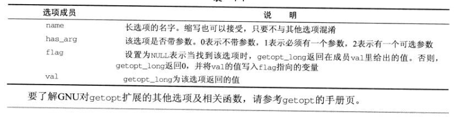
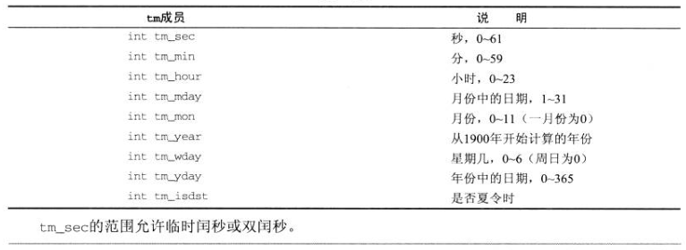

# Linux程序设计 中文第四版
## 第一章 入门
## 第二章 Shell程序设计
## 第三章 文件操作
## 第四章 Linux环境
### 4.1 程序参数
&emsp;一个用C语言编写的Linux或者UNIX程序运行时，是从main函数开始的。main函数的声明如下：
``` c
int main(int argc, char *argv[])
```
其中argc是程序参数的个数（包括程序的名字），argv是一个字符串数组。main的入参是默认存在的，但是如果不声明，在程序中是不可以使用的。<br>
&emsp;操作系统启动一个新程序时，argc和argv是怎么传到main里面的呢？这些参数一般由另一个程序提供，这个程序一般是shell。Shell接受用户输入的命令行，将命令行分解成单词，然后把这些单词放入argv数组。<br>
命令行参数设置规则：
* 所有命令行开关都应以一个短横线开头，其后包含单个字母或数字
* 如果某个选项需要值，则该值应作为独立参数紧跟该开关后面
* 不需要后续值的选项可以在一个短横线后归并到一起

#### 4.1.1 getopt
&emsp;为了帮助我们遵循命令行参数的规则，Linux提供了getopt函数，它支持需要关联值和不需要关联值得选项，而且简单易用。optstring只是一个字符列表，每个字符代表一个单字符选项。如果一个字符后面紧跟一个冒号(:)，则表明该选系那个有一个关联值作为下一个参数。
``` c
# include <stdio.h>
# include <unistd.h>
# include <stdlib.h>
int getopt(int argc, char *const argv[], const char *optstring);
extern char *optarg;       //外部变量
extern int optind, opterr, optopt;  //外部变量
int main(int argc, char* argv[])
{
  int opt;
  while((opt = getopt(argc,argv,":if:lr"))!=-1)
  {
    switch(opt)
    {
      case 'r':
        printf("option: %c\n",opt);
        break;
      case 'f':
        printf("filename: %s\n",optarg);
        break;
    }
  }
}

```
&emsp;getopt的返回值时argv数组中的下一个选项字符（如果有的话）。循环调用getopt就可以依次得到每个选项。getopt有如下行为：
* 如果选项有一个关联值，则外部变量optarg指向这个值
* 如果选项处理完毕，getopt返回-1，特殊参数--将使getopt停止扫描选项
* 如果遇到一个无法识别的选项，getopt返回一个问号(?)，并把它保存在外部变量optopt中。
* 如果一个选项要求有一个关联值(例如例子中的-f)，但用户并未踢欧冠呢，getopt通常会返回一个问号(?)。如果我们将选项字符串的第一个字符设置为冒号(:)，那么getopt将在用户未提供值得情况下返回冒号(:)而不是问号。
* optind被设置为下一个待处理参数的索引，getopt用它来记录自己的进度。

#### 4.1.2 getopt_long
&emsp;许多Linux应用程序也接受比哦我们在前面例子中所用到的单字符选项含义更明确的参数。GNU C函数库包含getopt的另一个版本，称作 getopt_long，它接受以双划线 (--) 开始的长参数。<br>
&emsp;getopt_long函数比getopt多两个参数。第一个附加参数是一个结构数组，描述了每个长度选项，并告诉getopt_long如何处理它们。第二个附加参数是一个变量指针，它可以作为optfind的长选项版使用。对于每个识别的长选项，它在长选项数组中的索引就写入该变量。在本例中，第二个附加参数可以为NULL。<br>
&emsp;长选项结构在头文件getopt.h中定义，并且该头文件必须与常量_GNU_SOURCE一同包含进来，用于启动getopt_long功能。
``` c
struct option{
  const char *name;
  int has_arg;
  int * flag;
  int val;
}
```
该结构的成员如下表所示：<br>


### 4.2 环境变量
&emsp;环境是有一组格式为“名字=值”的字符串组成。C语言程序中，可以受用putenv和getenv函数来访问环境变量。
``` c
#include <stdlib.h>
char * getenv(const char *name); //指定名称，返回变量值
int putenv(const char *string);  //给定"变量名=变量值"
```
#### 4.2.1 环境变量的用途
#### 4.2.2 environ变量
&emsp;程序可以直接通过environ变量直接访问环境变这个字符串数组。
``` c
extern **env = enciron;
```
### 4.3 时间和日期
&emsp;所有的UNIX系统都使用同一个时间和日期的起点：格林泥治时间(GMT)1970年1月1日午夜(0点)。这是**UNIX纪元的起点**。Linux系统中所有的时间都以从那时经过的秒数来衡量。
**常用函数**<br>
* time。你可以使用time函数得到底层的时间值；
* difftime。也可以使用difftime来计算两个time_t之间的秒数；
* gmtime。为了直观查看，还可以使用gmtime把时间值转换成可读的时间和日期；
* localtime。使用localtime可以得到本地的时间：
* mktime。把已分解出来的tm结构再转换为原始的time_t时间。
* asctime。返回一个表示时间的字符串
* ctime。同上面，都是用于直观展示时间用的。
``` c
# include <time.h>
time_t time(time_t *tloc);  //time_t是32位整形变量
double difftime(time_t time1,time_t time2);
struct tm *gmtime(const time_t timeval);
struct tm *localtime(const time_t* timeval);
time_t mktime(struct tm *timeptr);
char *asctime(const struct tm *temeptr);
char *ctime(const time_t *timeval);
```
tm结构被定义如下表所示：

&emsp;为了对时间和日期子妇产的格式有更多的控制，Linux和现代的类UNIX系统提供了strftime函数，它很像一个针对时间和日期的sprintf函数，工作方式也很类似。strftime函数格式化timeptr指针指向的tm结构所表示的时间和日期，并将结果保存在字符串s中。<br>
&emsp;为了读取日期，可以使用strptime函数，该函数以一个代表日期的字符串为参数，并创建表示同意日期和时间的tm结构。<br>
``` c
# include <time.h>
size_t strftime(char *s, size_t maxsize, const char *format, struct tm *timeptr);
char *strptime(const char *buf, const *format, struct tm *timeptr);
```
### 4.4 临时文件
&emsp;很多情况下程序会利用一些文件形式的临时存储手段。但需要确保应用程序为临时文件选取的文件名是唯一的。否则，不同程序可能会互相干扰。<br>
* tmpnam。使用tmpnam函数可以生成一个唯一的文件名。tmpnam函数返回一个不与任何已存在文件同名的有效文件名。如果字符串s不为空，文件名也会写入它。这个字符串至少要有L_tmpnam个字符。
* tmpfile。tmpfile函数返回一个文件流指针，它指向唯一一个临时文件，并且以读写方式打开，当对它的所有引用全部关闭时，该文件会自动删除。如果出错，tmpfile返回空指针并设置errno值。这种快速打开文件是有必要的，它可以防止另外程序打开它造成风险。

``` c
# include <stdio.h>
char *tmpnam(char *s);
FILE *tmpfile(void);
```
* UNIX有另一种生成临时文件名的方式，使用mktemp和mkstemp函数。Linux也支持这两个参数。不同之处在于可以为临时文件名指定一个模板，模板可以让你对文件的存放和名字有更多的控制。

``` c
# include <stdlib.h>
char *mktemp*char *template);
int mkstemp(char * template);
```
### 4.5 用户信息
&esmp;除了著名的init程序外，所有的Linux程序都是有其他程序或用户启动的。Linux运行的每个程序实际上都是以某个用户的名义在运行因此都有一个关联的UID。UID有它自己的雷兴国-uid_t，它定义在头文件sys/types.h中。一般情况下，用户的UID值都大于100。
* getuid。
* getlogin。

### 4.6 主机信息
## 第五章 终端
## 第六章 使用curses函数库管理基于文本的屏幕
## 第七章 数据管理
## 第八章 MySQL
## 第九章 开发工具
## 第十章 调试
## 第十一章 进程和信号
## 第十二章 POSIX线程
## 第十三章 进程间通信：管道
## 第十四章 信号量、共享内存和消息队列
## 第十五章 套接字
## 第十六章 用GTK+进行GNOME编程
## 第十七章 用Qt进行KDE编程
## 第十八章 Linux标准
