# Linux内核设计与实现 第三版
## 第一章 Linux内核简介
### 1.1 Unix历史
* 1969年，贝尔实验室的程序员们设计了一个文件系统原型，这个原型最终演化成了Unix。Thompson首先在一台无人问津的PDP-7型机上实现了这个操作系统。
* 1971年。Unix被移植到PDP-11中
* 1973年。Unix系统用C语言进行了重写
* 1977年。贝尔实验室综合这种Unix变体推出了Unix System 3
* 1983年。AT&T推出了System V
* 伯克利分校对Unix系统加入许多补丁以及软件。相继推出1BSD 2BSD（csh vi等软件） 3BSD以及4.0BSD等。

### 1.2 追寻Linux足迹
&emsp;1991年，Linux Torvalds为当时新推出的、使用Intel 80386微处理器的计算机开发了一款全新的操作系统，Linux由此诞生。是一位芬兰大学生受到一款教学用得Unix启发，独自开发的。
* linux是类Unix系统，但不是Unix，尽管Linux借鉴了Unix的许多设计，并实现了Unix的API（有Posix标准和其他Single Unix Specification定义的），但Linux没有直接使用源代码。
* Linux是开源的，它的成功是由于许可证条款的约定，Linux迅速成为多人的合作开发项目。
* Linux用途广泛，包含的东西也很多。Linux系统的基础是内核、C库、工具集和系统的基本工具。

### 1.3 操作系统和内核简介
&emsp;**操作系统**。是指整个系统中负责完成最基本功能和系统管理的那些部分。这些部分应该包括内核、设备驱动程序、启动引导程序、命令行Shell或者其他种类的用户界面、基本文件管理工具和系统工具。<br>
&emsp;**内核**。用户界面是操作系统的外在表象，内核才是操作系统的内在核心。内核有时候被称作管理者或者是操作系统核心。通常一个内核有负责响应中断的中断服务程序，负责管理多个进程从而分享处理器时间的调度程序，负责管理进程地址空间的内存管理程序和网络、进程间通信等系统服务程序共同组成。<br>
* 内核独立于普通应用程序，拥有受保护的内存空间和访问硬件设备的的所有权限。这种系统态和内存空间统称为**内核空间**。
* 系统中运行的程序通过系统调用与内核通信。应用程序通过调用库函数，再由库函数通过系统调用让内核工作。库函数提供了系统调用不具备的许多功能
* 内核负责管理系统的硬件设备。当硬件设备要想和系统通信的时候要发出一个终端信号，内核通过这个终端号查找相应的**中断服务程序**。中断服务程序一般都不在进程上下文中执行。它们在一个与所有进程都无关的、专门的中断上下文中运行。

&emsp;实际上每个处理器在任何指定时间点上的活动必然概括为下列三者之一：
* 运行于用户空间，执行用户进程
* 运行于内核空间，处于进程上下文，代表某个特定的进程执行
* 运行于内核空间，处于中断上下文，与任何进程无关处理某个特定的中断

以上所列几乎包括所有情况，即使边边角角的情况也不例外，例如，当CPU空闲的时候，内核就运行一个空进程，处于进程上下文，但运行于内核空间。<br>
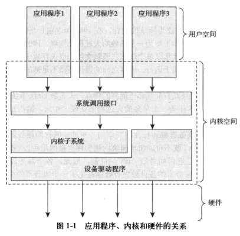

### 1.4 Linux内核和传统Unix内核的比较
&emsp;**MMU内存管理单元**。Unix内核需要硬件系统提供页机制（MMU）以管理内存。Linux的一些版本可以运行在没有MMU的小型嵌入系统上。
**单内核与微内核的设计比较** <br>
* 单内核。单内核是一种简单的设计，大多数Unix系统都设计成单模块，整体上作为一个单独的大过程，运行在一个单独的地址空间上。这种模式认为单模块具有简单和性能高的特点。
* 微内核。微内核功能被划分多个独立过程。所有过程独立运行各自的地址空间，不能像单内核那样直接调用函数，而是通过消息传递内核通信（IPC机制）。值得一提的是，很多实际应用的基于微内核的系统，为了避免上下文切换以及IPC开销，把全部或大部分服务器位于内核，这其实违背了微内核设计的初衷。

&emsp;Linux是一个单内核，也就是说，Linux内核运行在单独的内核地址空间上，不过Linux吸取了微内核的精华：模块化设计、抢占式内核、支持内核线程以及动态装载内核模块的能力。Linux让所有事情运行在内核态，直接调用函数，无须消息传递。

Linux内核与传统的Unix系统之间存在一些显著差异：
* Linux支持动态加载内核模块。尽管Linux内核也是单内核，可是允许在需要的时候动态卸除和加载部分内核代码。
* Linux支持对称多处理(SMP)机制。尽管许多Unix变体也支持SMP，但传统的Unix并不支持这种机制。
* Linux内核可以抢占。Linux具有允许在内核运行的任务优先执行的能力。
* Linux对线程支持的实现比较有意思：内核并不区分线程和其他的一半进程。对于内核来说，所有进程都一样-只不过是其中的一些共享资源而已。
* Linux提供具有设备类的面向对象的设备模型、热插拔事件，以及用户控件的设备文件系统。
* Linux忽略了一些被认为设计得很拙劣的Unix特性，像STREAMS，和一些过时标准
* Linux体现了自由这个词的精髓。

### 1.5 Linux的内核版本
&emsp;Linux通过三个或四个用"."分隔的数字来代表不同的内核版本。第一个数字是主版本号，第二个数字是从版本号，第三个数字是修订版本号，第四个可选数字是稳定版本号。从版本号是偶数，则该版本是稳定版(稳定版本后面的发布一般只能修改bug、新的驱动和少量新特性)，如果是奇数说明是开发版。<br>
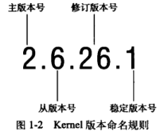<br>
&emsp;随着内核2.6版本已经被广泛接受，新版本的推出变得缓慢多了。后面的修改重点都在稳定性上面。<br>

### 1.6 Linux内核开发者社区
&emsp;Linux开发最重要的论坛是Linux kernel mailing list（常缩写为lkml），可以在<http://vegr.kernel.org>订阅邮件，每天有几百条信息，但这些是学习Linux非常好的资源。你可以向其它从事内核开发的人寻求帮助。<br>

## 第二章 从内核出发
### 2.1 获取内核源码
&emsp;Linux内核官方网站<http://www.kernel.org> <br>
&emsp;内核代码查看工具推荐：Source Insight 4.0。使用技巧：<https://www.cnblogs.com/xunbu7/p/7067427.html> <br>
#### 2.1.1 使用GIt
&emsp;Linus和他领导的内核开发者开始使用Git来管理Linux内核源代码。你可以使用Git来获取最新提交到linus版本树的一个副本：
``` bash
git clone git://git.kernel.org/pub/scm/linux/kernel/git/torvalds/linux-2.6.git
```
#### 2.1.2 安装内核源代码
&emsp;内核压缩GNU zip(gzip)和bzip两种形式发布。bzip是首选默认形式，因为压缩上更有优势，下载后的格式如linux-x.y.z.tar.bz2。然后运行：
``` bash
tar xvjf linux-x.y.z.tar.bz2  #
tar xvzf linux-x.y.z.tar.gz
```
&emsp;如果使用git获取代码，就不需要下载压缩后的文件，也不需要解压。<br>
&emsp;**安装位置**。内核源码一般安装在/usr/src/linux目录下。不要把这个源码树用于开发，因为编译你的C库所用的内核版本就连接到这颗树。也不要以root身份对内核进行修改，而是应当建立自己的主目录，仅以root身份安装新内核。

#### 2.1.3 使用补丁
&emsp;使用补丁的好处是不需要下载庞大的内核，一般来说一个给定版本的内核补丁总是打在前一个版本上。要应用增量补丁，从你的内部源码树开始，只需运行：
``` bash
patch -pl < ../patch-x.y.z
```

### 2.2 内核源码树
&emsp;内核源码树由很多目录组成，而大多数目录又包含更多的字幕了，源码树的根目录及其子目录如表2-1所示：
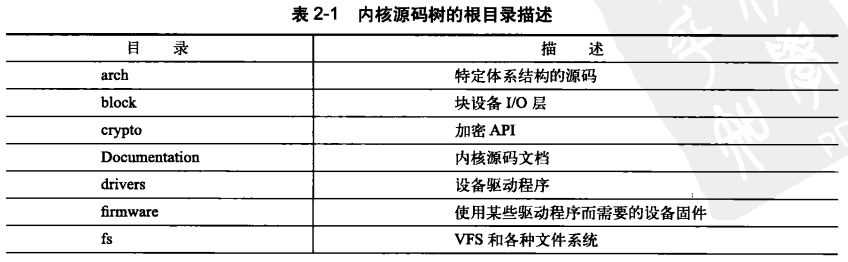
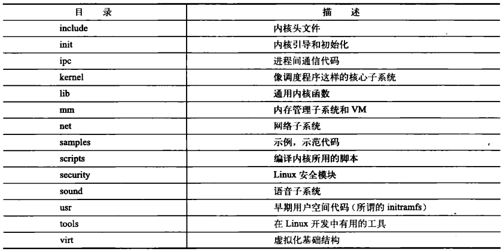
**根目录中比较重要的文件**
* COPYING。文件内核许可证(GNU GPL v2)
* CREDITS。开发了很多内核代码的开发者列表
* MAINTAINERS。维护者列表
* Makefile。基本内核的Makefile

### 2.3 编译内核
#### 2.3.1 配置内核
&emsp;在编译内核之前，要想把自己需要的特定功能和驱动程序编译进内核，必须先进行配置。配置选项形式像：CONFIG_FEATURE，CONFIG是前缀。配置的选项要么是二选一，要么三选一(yes,no,module)。例如：
* CONFIG_SMP。是否启用SMP
* CONFIG_PREEMPT。是否开启内核抢占功能
* CONFIG_IKCONFIG_PROC。该选项会被压缩过的内核配置文件保存在/proc/config.gz中，你可以复制它来重新便以一个内核

&emsp;内核配置**最简单**的方法就是运行：
``` bash
make CONFIG
```
该工具会逐一遍历所有配置项，要求用户选择yes, no或者module。但这个过程往往要耗费掉很长的时间。<br>

&emsp;如果你比较赶时间，你可以选择基于ncurse库编制的**图形界面工**具，或者基于gtk+的图形工具：
``` bash
make menuconfig
make gconfig
```
&emsp;**默认配置**，下面的命令会基于默认的配置为你的体系结构创建一个配置：
``` bash
make defconfig
```
&emsp;这些配置项会被存放在内核代码树目录下的.config中，可以直接修改这个文件。有了配置文件后，还不能立马编译内核，你应该验证和更新配置：
``` bash
make oldconfig
```
&emsp;配置文件完成后，在内核文件夹的根目录下使用下面命令就可以完成编译：
``` bash
make
```

#### 2.3.2 减少编译的配置垃圾信息
&emsp;不想看到垃圾信息，又不希望错过错误报告，可以使用输出重定向：
``` bash
make > ../detritus   #编译信息输出到指定文件中
make > /dev/null     #丢掉所有信息
```

#### 2.3.3  衍生多个编译作业
&emsp;linux内核编译时间比较长，可以让作业并发运行。因为内核的不会产生互相踩踏，导致编译过程出错。多核编译可以使用：
``` bash
make -jn   #n一般代表核心数的1或者2倍
```

#### 2.3.4 安装新内核
* 在使用grub的x86系统上，可能需要把arch/i386/boot/bzImage拷贝到/boot目录下，像vmlinuz-version这样命令，然后编辑/etc/grub/grub.conf文件，为新内核建立一个新的启动项。
* 使用LILO启动的系统应当编辑/etc/lilo.conf，然后运行lilo

&emsp;模块的安装是自动的，只需要以root身份运行下面命令皆可以把编译好的模块安装到主目录/lib/modules下：
``` bash
make modules_install
```

### 2.4 内核开发的特点
内核开发和普通用户程序开发的差异：
* 内核编程时既不能访问C库也不能访问标准的C头文件
* 内核编程时必须使用GNU C
* 内核编程缺乏像用户控件那样的内存保护机制
* 内核编程时难以执行浮点运算
* 内核给每个进程只有很小的定长堆栈
* 由于内核支持异步中断、抢占和SMP，因此必须时刻注意同步和并发
* 要考虑可移植性的重要性

#### 2.4.1 无libc库抑或是无标准头文件
&emsp;内核不能链接标准C库函数（或者其它库）。造成的原因很多，比如先有蛋还是先有鸡，但主要原因是C库太低效了。但是大部分常用的C库函数再内核中都已经实现了。比如：
* 字符操作函数。在lib/string.c中，包含linuc/string.h就可以使用
* 基本的头文件位于内核源代码树的include/linux目录下
* 体系结构相关的头文件位于内核源代码树的arch/<architecture>/include/asm目录下。比如x86体系结构：arch/x86/include/asm目录下

#### 2.4.2 GUNC
&emsp;Linux使用C语言写的。但是内核并不完全符合ANSI C标准。内核开发者使用的C语言涵盖了ISO C99标准和GNU C扩展特性。与标准C语言的区别，通常也是人们不熟悉的那些变化，多数集中在GNU C上。让我们研究一下内核代码中所使用到的C语言扩展部分：
* 内联函数。内核开发者通常把哪些对时间要求比较高，二本身长度比较短的函数定义为内联函数，内联函数必须在使用之前就定义好，在内核中，为了类型安全和易读性，优先使用内联函数而不是复杂的宏。定义的方式如下：
``` c
static inline void wolf(unsigned long tail_size);
```
* 内联汇编。gcc编译器支持在C函数中嵌入汇编指令。当然，在内核编程的时候，只有知道对应的体系结构，才能使用这个功能。通常使用asm()指令嵌入汇编代码。例如下面代码用于执行x86处理器的rdtsc指令，返回时间戳(tsc)寄存器的值：
``` c
unsigned int low,high;
asm volatile("rdtsc": "=a"(low),"=d"(high))
```
Linux内核混合使用了C语言和汇编语言。在偏体系结构的底层或者执行时间要求严格的地方，一般使用汇编，其他大部分地方使用C语言编写。
* 分支声明。gcc内建了一条指令用于优化条件选择语句，用于标记经常出现或者很少出现的情况。内核把这条指令封装成了宏：likely()和unlikely()。

#### 2.4.3 没有内存保护机制
&emsp;和用户程序不同（内核可以发现用户程序错误），如果进行非法的内存访问（内核出现oops内存错误），后果无法控制。此外内核中的内存都不分页，每用掉一个字节，物理内存就减少一个字节。<br>

#### 2.4.4 不要轻易在内核中使用浮点数
&emsp;内核不能完美支持浮点操作。由于本身不能陷入，在内核中要使用浮点数，要做的操作比较多。<br>

#### 2.4.5 容积小而固定的栈
&emsp;用户程序可以从栈上非配大量的空间，而且还可以大量增长。但内核栈的大小随体系结构而变。在x86上，栈的大小在编译时配置，可以是4KB也可以是8KB。内核栈的大小事两页，32位机内核栈是8KB，64位机是16KB。<br>

#### 2.4.6 同步和并发
&emsp;内核会很容易产生竞争条件。内核要求能够并发访问共享数据，这就要求有同步机制以保证不出线竞争条件，特别是：
* Linuxs 是抢占式多任务操作系统。内核的进程调度程序记性对进程进行调度和重新调度
* Linux内核支持对称多处理系统(SMP)。如果没有保护，两个或两个以上的处理器执行内核代码很可能同时访问同一个资源。
* 中断是异步到来的。完全不顾及正在执行的代码，终端有可能在代码访问资源的时候到来，从而访问同一个资源。所以这需要保护
* Linux内核可以抢占。如果不加以保护，内核中一段执行的代码可能会被另一端抢占，造成几段代码同时访问相同资源的情况。

&emsp;常用的解决方法是自旋锁和信号量。后续会有更多介绍。<br>

#### 2.4.7 可移植性的重要性
&emsp;Linux是一个可移植操作系统，所以大部分C代码应该与**体系结构无关**。与体系结构相关的代码应该从内核代码树种适当分离出来。诸如保持字节序、64位对齐、不假定字长和页面长度等一系列准则。

## 第三章 进程管理
### 3.1 进程
&emsp;进程是程序的执行过程以及包括资源的总称。包括代码段，打开的文件，挂起的信号，内核内部数据，处理器状态，一个或多个内存映射的内存地址空间及一个或多个执行线程，还有存放全局变量的数据段等。<br>：
* fork()。该函数通过复制一个现有进程来创建新的进程。fork()实际上由clone()系统调用实现的。
* exit()。系统调用，可以退出执行
* exec()。创建新的地址空间
* wait4()。父进程通过wait4()系统调用查询子进程是否终结

&emsp;执行线程。每个线程都有独立的程序计数器、进程栈和一组进程寄存器。Linux对线程和进程并不特别区分。对Linux而言，线程只不过是一种特殊进程。

### 3.2 进程描述符及任务结构
&emsp;内核把进程的列表存放在任务队列中(task list)的双向循环链表中。链表中的每一项都是大小为1.7KB的task_struct进程描述符。该结构定义在<linux/sched.h>。
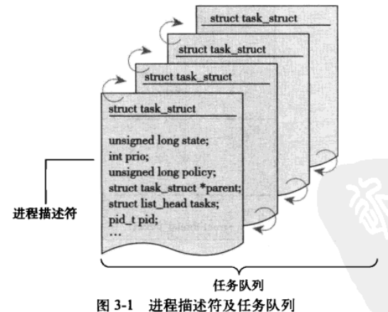
#### 3.2.1 分配进程描述符
&emsp;2.6及以后的内核版本，由于slab分配器动态生成task_struct，在每个进程的内核栈顶或者栈底创建一个新的结构struct thread_info，这个结构的task成员指向实际的task_struct地址。x86中，struct thread_info定义在asm/thread_info.h中：
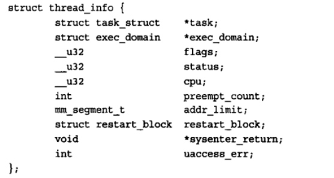
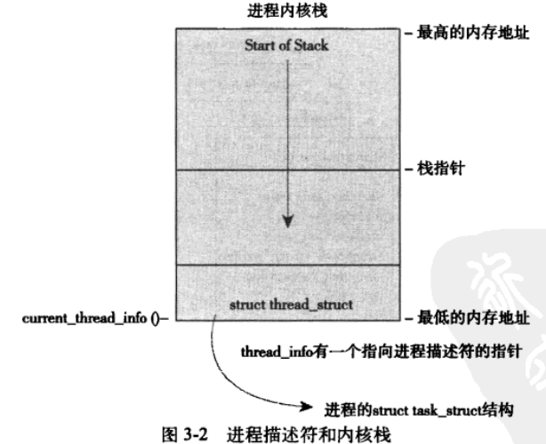
#### 3.2.2 进程描述符的存放
&emsp;**进程标识值**。内核通过PID来标识每个进程。PID是一个int类型，最大默认设置为32768，可以增加到400万(通过修改/proc/sys/kernel/pid_max来提高)。内核把每个进程的PID存放到各自的进程描述符中。<br>
&emsp;内核中大部分处理进程的代码都是直接通过task_struct进行的，通过current宏查找正在运行进程的进程描述符。硬件体系不同，该宏的实现也不同。有的是通过寄存器直接访问，而有的像x86架构通过栈指针加偏移计算得来的。<br>
#### 3.2.3 进程状态
&emsp;进程描述符中的state域描述了进程的当前状态(见图3-3)。系统中的每个进程都必然处于五种进程状态中的一种。该域的值也必为下列五种状态之一：
* TASK_RUNNING (运行)。正在执行或者在运行队列中等待执行。进程在用户空间执行唯一可能的状态。
* TASK_INTERRUPTIBLE (可中断)。进程被阻塞，等待某些条件的达成。条件打成或被其他进程唤醒，就会把状态设置为运行态。
* TASK_UNINTERRUPTIBLE (不可中断)。接受到信号也不会被唤醒或准备揉入运行。这个状态使用得比较少。
* _TASK_TRACED。被其他进程跟踪的进程，例如通过ptrace对调试程序进行跟踪。
* _TASK_TTOPED。停止状态，进程停止执行：没有投入运行也不能投入运行。通常这种状态发生在接收到SIGSTOP、SIGTSTP、SIGTTIN、SIGTTOU等信号的时候。此外，在调试期间接收到任何信号，都会使进程进入这种状态。
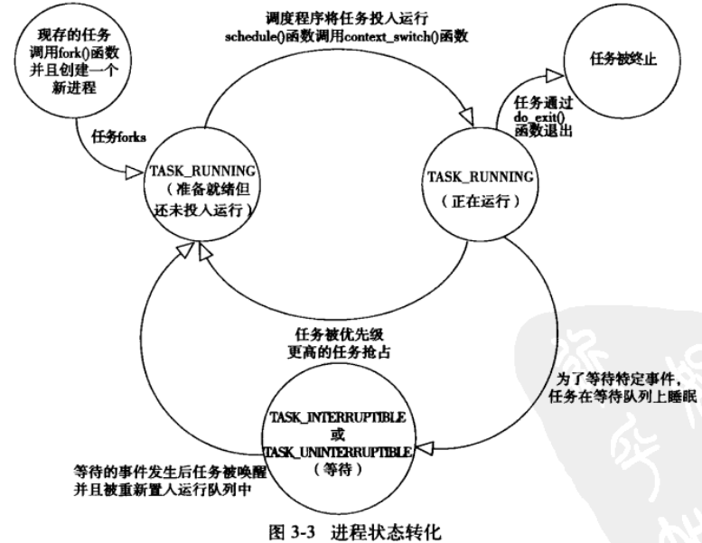

#### 3.2.4 设置进程当前状态
调整某个进程的状态。在linux/sched.h中，使用：
``` c
set_task_state(task, state);
set_current_state(current, state);
```

#### 3.2.5 进程上下文
&emsp;当一个程序调用执行了系统调用或者触发了某个异常，它就陷入了内核空间。此时，我们称内核“代表进程执行”并处于进程上下文中，在此上下文中current宏是有效的。<br>
&emsp;除了进程上下文，还有中断上下文，在中断上下文中，系统不代表进程执行，而是执行一个中断处理程序。不会又进程去干扰这些中断处理程序，所以此时不存在进程上下文。<br>

#### 3.2.6 进程家族树
&emsp;Linux系统中，所有进程都是PID为1的init进程的后代。内核在系统启动的最后阶段启动init进程。该进程读取系统的初始化脚本(initscript)并执行其他相关程序，最终完成系统的整个过程。<br>
&emsp;task_struct结构体里面有一个parent指针指向父进程，还有一个称为children的指针指向子进程列表。可以使用下面的方式依次访问子进程：
``` c
struct task_struct *task;
struct list_head *list;
list_for_each(list,&current->children){
  task = list_entry(list,struct task_struct,sibling);
}
```
&emsp;由于任务队列是一个双向循环列表，从任何一个进程出发都可以查找到任意指定的其他进程。对于一个给定的进程，获取链表中的下一个和上一个进程可以用：
``` c
list_entry(task->tasks.next, struct task_struct, tasks); //下一个进程
list_entry(task->tasks.prev, struct task_struct, tasks);  //上一个进程
```

### 3.3 进程创建
&emsp;Unix系统采用两个单独的函数实现创建进程: fork() exec()。子进程与父进程的区别仅仅在于PID和PPID(父进程的进程号)，和某些资源和统计量(例如，挂起的信号)，exec()函数负责读取可执行文件并将其载入地址空间开始运行。这两个函数合起来和其它系统效果类似。<br>

#### 3.3.1 写时拷贝
&emsp;传统fork()系统调用直接把所有的资源复制给新创建的进程，这种实现效率低下。Linux的fork()使用功能写时拷贝(copy-on-write)页实现。
&emsp;只有在需要写入的时候，数据才会被复制。这种优化便于快速创建子进程，并快速执行。

#### 3.3.2 fork()
&emsp;frok(), vfork() 和 __clone()函数都根据各自需要的参数标志去调用clone(), 然后clone()去调用do_fork()。do_fork()完成创建中的大部分工作，它的定义在kernel/fork.c文件中。该函数调用copy_process()函数。copy_process()的作用：
* 1）调用dup_task_struct()为新进程创建一个内核栈、thread_info结构以及task_struct，这些值与当前进程的值相同。此时父子进程描述符是完全相同的。
* 2)检查并确保新创建这个子进程后，当前用户所拥有的进程数目没有超出给它分配的资源的限制。
* 3子进程着手使自己与父进程区别开来。进程描述符中许多成员要被重新初始化，其它的大多数不作修改。
* 4) 子进程的状态被设置为TASK_UNINTERRUPTIBLE，以保证不会投入运行。
* 5)copy_process()调用copy_flags()以更新task_struct的flags成员，重置PF_SUPERPRIV标志。重置PF_FORKNOEXEX标志。
* 6)调用alloc_pid()为新进程分配一个有效PID。
* 7)根据传递给clone()的参数标志，拷贝或共享打开的文件、文件系统信息、信号处理函数、进程地址空间和命名空间等。
* 8)最后，copy_process()做扫尾工作，并返回一个指向进程的指针。

#### 3.3.3 vfork()
&emsp;除了不拷贝父进程的页表项外，vfork()系统调用和fork()功能相同。不需要使用vfork()。具体原因不需要了解。

### 3.4 线程在Linux中的实现
&emsp;linux的线程机制和其他很多操作系统不同。从内核角度来说，linux没有线程的概念，线程仅仅被视为一个与其他进程共享某些资源的进程。举个例子，加入有一个包含四个线程的进程，在提供专门线程支持的系统中(Microsoft Windows或Sun Solaris)，通常会有一个包含指向四个不同线程的指针的进程描述符。而Linux仅仅创建四个进程分配四个task_struct结构。

#### 3.4.1 创建线程
&emsp;创建线程和普通进程创建类似，只不过调用clone()的时候传递的参数标志不相同：父子俩共享地址空间、文件系统资源、文件描述符和信号处理程序：
``` c
clone(CLONE_VM | CLONE_FS | CLONE_FILES | CLONE_SIGHAND, 0);
```
&emsp; 普通的fork()实现：
``` c
clone(SIGCHLD, 0);
```
&emsp;而vfork()的实现是：
``` c
clone(CLONE_VFORK | CLONE_VM | SIGCHLD, 0);
```
&emsp;传递给clone()参数标志决定了新创建进程的行为方式和父子进程之间共享的资源种类，表3-1定义了这些参数标志：
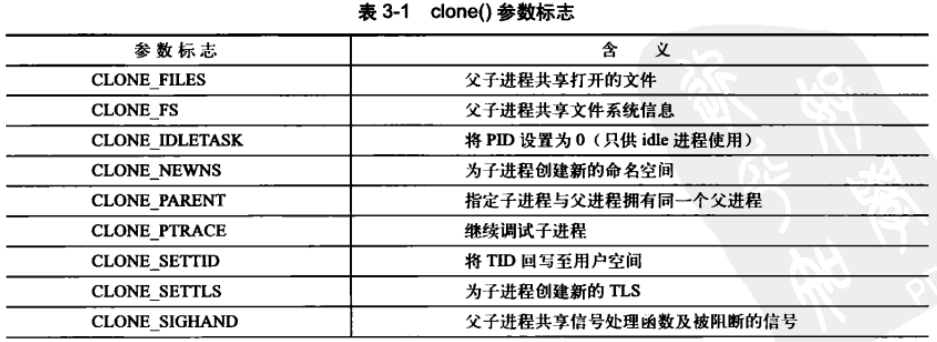
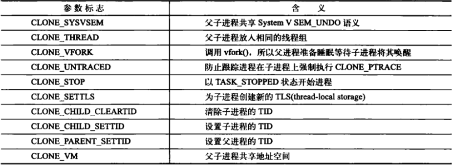

#### 3.4.2 内核线程
&emsp;独立运行在内核空间的标准进程叫做内核线程。内核线程没有独立的地址空间（地址空间mm指针设置为NULL)。他会被切换到内核空间去，但可以被调度也可以被抢占。
&emsp;使用ps -ef可以看到有很多内核线程，内核线程是系统启动时由另外一些内核线程创建。内核是通过kthreadd内核进程衍生出所有新的内核线程自动处理这一点的。在<linux/kthread.h>中声明有借口，创建内核线程的方法：
``` c
struct task_struct *kthread_create(int (*threadfn)(void *data),
                                   void *data,
                                   const char namefmt[],
                                   ...)
```
&emsp;新的进程将运行threadfn函数，给其传递的参数是data。进程会被命名为namefmt。新创建的进程处于不可运行状态，要调用wake_up_process()明确去唤醒它。创建一个进程并唤醒它，可以调用kthread_run()：
``` c
struct task_struct *kthread_run(int (*threadfn)(void *data),
                                void *data,
                                const char namefmt[],
                                ...)
```
&emsp;内核线程一直运行知道调用do_exit()退出，或者内核其它进程调用kthread_stop()来退出。

### 3.5 进程终结
&emsp;进程的终结不管是自身还是外部因素，大部分都要靠do_exit()来完成，定义于<kernel/exit.c>中，它要做下面这些工作：
* 1) 将task_struct中的标志成员设置为PF_EXITING
* 2）调用del_timer_sync()删除任意内核定时器。根据返回结果，它确保没有定时器在排队，也没有定时器处理程序在运行
* 3）如果BSD的进程记账功能是开启的，do_exit()调用scct_update_integrals()来输出记账信息
* 4)然后调用exit_mm()函数释放进程占用的mm_struct, 如果没有别的进程使用它们（也就是说，这个地址空间没有被共享），就彻底释放它们。
* 5)接下来调用sem_exit()。如果进程排队等待IPC信号，它则离开队列。
* 6)调用exit_files()和exit_fs()，分别递减文件描述符、文件系统数据的引用计数。如果其中某个引用计数的数值将为0，那么就代表没有进程在使用相应的资源，此时可以释放。
* 7)把村长task_struct的exit_code成员中的任务退出码置为由exit()提供的退出代码。退出代码存放在这里供父进程随时检索。
* 8)调用exit_notify()向父进程发送信号。给子进程重新找养父，养父为线程组中的其他线程或者init进程，并把进程状态(task_struct.exit_state)设为EXIT_ZOMBIE，也就是僵尸进程
* 9)do_exit()调用schedule()切换到新的进程。因为处于EXIT_ZOMBIE状态的进程不会再被调度。do_exit()永不反悔。

#### 3.5.1 删除进程描述符
&emsp;调用do_exit()之后，线程已经僵死，但是还有进程描述符存在。wait()这一族函数都是通过唯一（但是很复杂）的一个系统调用wait4()来实现的。当最终需要释放进程描述符的时候，release_task()会被调用，它用于完成以下工作：
* 1)它调用_exit_signal()，该函数调用_unhash_process()，后者又调用detach_pid()从pidhash上删除该进程，同时也要从任务列表中删除该进程。
* 2)_exit_signal()释放目前僵死进程所使用的所有剩余资源，并进行最终统计和记录。
* 3)如果这个进程是线程组最后一个进程，并且领头进程已经死掉，那么release_task()就要通知僵死的领头进程的父进程。
* 4)release_task()调用put_task_struct()释放进程内核栈和thread_info结构所占的页，并释放task_struct所占的slab告诉缓存。

#### 3.5.2 孤儿进程造成的进退维谷
&emsp;如果父进程在子进程之前推出，必须有机制保证子进程能找到一个新的父亲。在do_exit()中会调用exit_notify()，该函数或调用forget_original_parent()，而后者会调用find_new_reaper()来执行寻父过程。如果进程所在线程组内没有其他进程。那么就会返回init进程。 <br>
&emsp;然后调用ptrace_exit_finish()进行新的寻父过程，不过这次是给ptraced的子进程寻找父亲。 <br>
&emsp;一旦系统为进程成功地找到和设置了新的父进程，就不会再有出现驻留僵死进程的危险了。init进程会理性调用wait()来检查子进程，清除所有与其相关的僵死进程。 <br>

## 第四章 进程调度
&emsp;进程调度没有复杂的原理。只要有可以执行的进程，那么总会有进程正在执行。
### 4.1 多任务
* 抢占式多任务。Linux系统提供了抢占式的多任务模式。由调度程序决定进程的运行，以便其他进程能够运行，这个强制的挂起操作叫做抢占。
* 非抢占式多任务。除非进程自己主动停止运行，否则它会一直执行。进程主动挂起自己的操作称为让步(yielding)。

### 4.2 Linux的进程调度
&emsp;早期的调度程序都相当简陋，在多进程或者多处理器的环境下难以胜任。在linux2.5中采用O(1)带调度程序。主要得益于静态时间片算法和针对每一处理器的运行队列。<br>
&emsp;O(1)虽然对于大服务器的工作负载很理想，但是在有很多交互程序要运行的桌面系统上表现不佳。自2.6内核后，引进新的进程调度算法，叫做**反转楼梯最后期限调度算法**(ROtation Staircase Deadline scheduler)(RSDL)，也被称为**完全公平调度算法**，简称CFS。<br>

### 4.3 策略
#### 4.3.1 I/O消耗型和处理器消耗型的进程
* I/O消耗型。进程的大部分时间用来提交I/O请求或者等待I/O请求。只有很少的时间在运行。
* 处理器消耗型。处理器消耗型大部分时间用在执行代码。除非被抢占，否则他们通常都一直不停地运行，因为它们没有太多的I/O需求。这种进程一般不应该经常对它进行调度。

&emsp;调度的策略通常要在两个矛盾的目标中间寻找平衡：进程响应迅速（响应时间短）和最大系统利用率（高吞吐量）。

#### 4.3.2 进程优先级
&emsp;Linux采用两种不同的优先级范围：
* nice值。它的范围从-20到+19。默认值为0。越大的nice值意味着更低的优先级。低nice值的进程可以获得更多的处理器时间。ps -el结果中可以查到进程对应的nice值。
* 实时优先级。可配置，范围0-99。和nice相反，越高的实时优先级意味着进程优先级越高。任何实时进程的优先级都要高于普通进程。

#### 4.3.3 时间片
&emsp;时间片是一个数值，它表明进程在被抢占前所能持续运行的时间。调度策略必须规定一个默认的时间片，但这并不是件简单的事。时间片太长，会导致系统对交互的响应表现欠佳；而时间片太短，会明显增大进程切换带来的处理器耗时。<br>
&emsp;Linux的CFS调度器将处理器的使用比划分给了进程。进程所获得的处理器时间和系统负载密切相关。这个比例还会受到nice值得影响(权重)。新的可运行进程是否抢占当前进程，取决于**新的可运行程序消耗了多少处理器使用比**。如果使用比比当前进程小，则新进程立刻投入运行，否则推迟其运行。<br>

#### 4.3.4 调度策略的活动
&emsp;让我们考虑一个简单的例子，有一个文本编辑程序和一个视频编码程序，拥有同样的nice值。文本编辑需要在它需要的时候能得到处理器，获得高的响应速度，而视频编码需要系统给它更多的处理器时间。先进的操作系统能够自动发现文本编辑程序时交互性程序，从而自动的给文本编辑继承更多的时间片和优先级。Linux系统采用的方法不同。 <br>
&emsp;给两个程序需同样的资源，各50%的处理器时间。一旦文本编辑器被唤醒，CFS注意到给它的处理器使用比是50%，但是其实它使用得很少，所以CFS为了表现公平，让它直接抢占视频解码进程。而当文本编辑器进入睡眠后，CFS发现文本编辑器并没有消费掉承诺给它的50%处理器使用比。 <br>

### 4.4 调度算法
#### 4.4.1 调度器类
&emsp;Linux调度器是以模块方式提供的，可以允许不同类型的进程可以有针对性地选择调度算法。基础的调度器代码定义在<kernel/sched.c>文件中。 <br>
&emsp;CFS算法定义在<kernel/sched_fair.c>文件中。 <br>
#### 4.4.2 Unix系统中的进程调度
&emsp;Unix系统上，优先以nice值形式输出给用户空间。要考虑一下几个问题：
* 第一个问题，nice值和时间片的关系。低优先级(nice越高)相比高优先级(nice越低), 理论上应该占用更多的处理器时间，但是给定高nice值得进程往往是后台进程，且是计算密集型。这种分配方式显然是和初衷背道而驰的。
* 第二个问题，相对nice值。nice值增大或者减小，对调度的影响与nice初始值有关。
* 第三个问题，nice到时间片的映射，需要一个绝对的时间片，最小的时间片必须是定时器节拍的整数倍。
* 第四个问题，用户为了优化交互任务，而玩弄调度器的后门，使得进程打破公平原则，获得更多的处理器时间，损害系统中其它进程的利益

&emsp;虽然Unix有很多方法可以解决某些问题，但解决方案没有改变实质问题-即分配绝对的时间片引发的固定的切换频率。CFS采用的方法是对时间片分配方式进行根本性重新设计：完全摒弃时间片而是分配给进程一个处理器使用比重。<br>

#### 4.4.3 公平调度
&emsp;CFS的做法是允许每个进程运行一段时间、循环轮转、选择运行最少的进程作为下一个运行进程，而不是采用分配给每个进程时间片的做法了。nice值在CFS中被作为进程获得的处理器运行比的权重。每个进程获得的时间片底线是1ms，也就是说不管有多少进程，它们至少能获得1ms的运行时间。  <br>
&emsp;总结一下：任何进程所获得的处理器时间是由它自己和其他所有可运行进程nice值得相对差值决定的。任何nice值对应的绝对时间不再是一个绝对值，而是处理器的使用比。   <br>

### 4.5 Linux调度的实现
&emsp;CFS调度算法的实现文件在<kernel/sched_fair.c>
* 时间记账
* 进程选择
* 调度器入口
* 睡眠和唤醒

#### 4.5.1 时间记账
&emsp;所有调度器都必须对进程运行时间做记账。每次系统时钟节拍发生时，时间片就会被减少一个节拍周期，当一个进程的时间片被减少到0时，就会被另一个尚未减到0的时间片可运行进程抢占。
* 1)调度器实体结构。CFS没有时间片的概念，但是会使用调度器实体结构struct sched_entity(定义在文件<linux/sched.h>中)来追中进程的运行记账。并且调度器实体结构作为一个进程描述符struct task_struct结构的一个成员变量se。
* 2)虚拟实时。vruntime变量存放进程的虚拟运行时间，该运行时间（花在运行上的时间和）的计算式经过所有可运行进程总数的标准化（或者说被加权的）。CFS需要vruntime变量来记录一个程序到底运行了多长时间，以及它还应该再运行多久。
  * linux中使用update_curr()计算vruntime。它由系统定时器周期性调用。

#### 4.5.2 进程选择
&emsp;CFS使用红黑树来组织可运行进程队列，然后找到最小vruntime作为下一个要运行的进程。红黑树存储了系统中所有可运行的进程，其中节点的键值就是可运行进程的虚拟运行时间。
* 1)挑选下一个任务。在红黑树中，vruntime最小的那个节点，就在最左边的那个叶子节点。只需要调用_pick_next_entity()函数就好了。
``` c
static struct sched_entity *_pick_next_entity(struct cfs_rq *cfs_rq);
```
* 2）向树中加入进程。当进程变成可运行状态或者fork()的时候，enqueue_entity()会向树中加入进程。该函数先更新运行参数和其它一些统计信息，然后调用_enque_entity()把数据项真正插入到红黑树中。
``` c
static void enqueue_entity(sturct cfs_rq * cfs_rq,struct sched_entity *se, int flags);
```
* 3)从树中删除进程。删除进程发生在进程堵塞(或不可运行状态)或者进程终止。调用dequeue_entity()，这个函数又调用_dequeue_entity()删除节点。由于红黑树继承了rb_erase()函数，直接调用这个函数就可以了，然后再更新rb_leftmost这个成员就好了。
``` c
static void dequeue_entity(struct cfs_rq *cfs_rq, struct sched_entity *se, int sleep);
```
#### 4.5.3 调度器入口
&emsp;进程的主要入口点是函数schedule()，它定义在<kernel/sched.h>。它是内核其他部分用于调用进程调度器的入口：选择哪个进程可以运行，何时将其投入运行。这个函数会调用pick_next_task()(也是定义在文件<kernel/sched.c>中)，pick_next_task()会以优先级为序，从高到低，依次检查每一个调度类，并且从最高优先级的调度类中，选择最高优先级的进程。
``` c
static inline struct task_struct * pick_next_task(struct rq *rq);
```
#### 4.5.4 睡眠和唤醒
&emsp;进程休眠一般都是为了等待某种事件，比如一些I/O操作，或者信号量等。内核把自己标为休眠状态，并从可执行红黑树中移除，放入等待队列，然后调用schedule()选择和执行一个其它进程。
##### 1 等待队列。
&emsp;等待队列是由等待某些事件发生的进程组成简单的链表。内核用wake_queue_head_t来代表等待队列。等待队列可以通过DECLARE_WAITQUEUE()静态创建，也可以由init_waitqueue_head()动态创建。
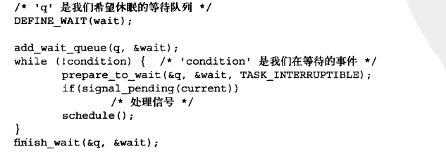
通过执行下面几个步骤将自己加入到一个等待队列中：
* 1)调用DEFINE_WAIT()创建一个等待队列的项
* 2)调用add_wait_queue()把自己加入到队列中。在其它地方需要编写相关代码，在事件发生时，对等待的队列执行wake_up()操作。
* 3)调用prepare_to_wait()将进程的状态变更为TASK_INTERRUPTIBLE或TASK_UNINTERRUPTIBLE。而且该函数有必要的话将进程加回到等待队列。
* 4)如果状态被设置为TASK_INTERRUPTIBLE，则信号唤醒进程。这是所谓的伪唤，事件并没有发生，因此检查并处理信号。
* 5)当进程被唤醒的时候，它会再次检查条件是否为真。如果是，它就是退出循环；如果不是它再次调用schedule()并一直重复这步操作。
* 6)当条件满足后，进程将自己设置为TASK_RUNNING并调用finish_wait()方法自己移除队列。

&emsp;另一个更好用的接口是inotify_read()，位于<fs/notify/inotify_user.c>中。<br>

##### 2 唤醒
&emsp;唤醒操作通过函数wake_up()进行，他会唤醒指定等待队列上的所有进程。主要就是把进程设置为TASK_RUNNING状态，然后调用enqueue_task()将此进程放入红黑树中。

### 4.6 抢占和上下文切换
&emsp;**上下文切换**。从一个可执行进程切换到另一个可执行进程。由定义在<kernel/sched.c>中的context_switch()函数负责处理。每当一个新的进程被选出来投入运行时，schedule()就会调用该函数。它包含两项基本工作：
* 调用witch_mm()(声明在<sam/mmu_context.h>中)，该函数负责把虚拟内存从上一个进程映射切换到新进程中。
* 调用switch_to()(声明在<asm/system.h>中)，负责处理器状态切换。包括保存、恢复栈以及寄存器信息，还有其他体系结构相关的状态信息。

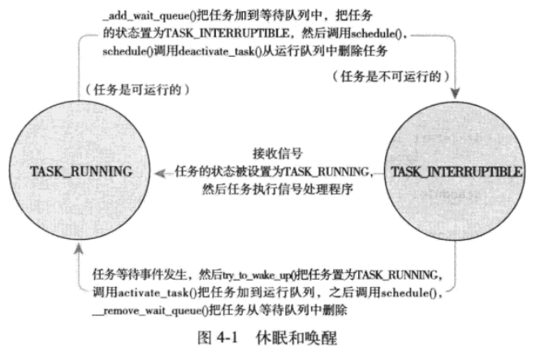

#### 4.6.1 用户抢占
#### 4.6.2 内核抢占

### 4.7 实时调度策略
### 4.8 与调度相关的系统调用

## 第五章 系统调用
### 5.1 与内核通信
&emsp;**系统调用**在用户空间和硬件设备之间添加了一个中间层，用户空间访问内核的唯一手段，有三个作用：
* 为用户空间提供一种硬件的抽象接口
* 保证系统的稳定和安全
* 多任务和虚拟内存的需要

### 5.2 API、POSIX和C库
&emsp;一般情况下，应用程序通过用户空间实现的应用编程接口(API)，而不是直接调用系统调用。API可以在不同操作系统上实现，给应用程序完全相同的接口。<br>
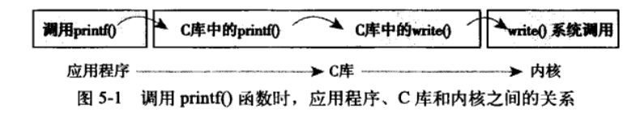
&emsp;在Unix世界中，最流行的应用编程接口是基于POSIX标准的，C库提供了POSIX的大部分API。<br>

### 5.3 系统调用
&emsp;例如get_pid系统调用的实现：
``` c
SYSCALL_DEFINE0(getpid)
{
  return rask_tgid_vnr(current); //returns current->tgid
}
```
&emsp;SYSCALL_DEFINE0只是一个宏，它定义一个无参数的系统调用（因此这里是数字0)，展开后的代码如下：
``` c
asmlinkage long sys_getpid(void);
```
#### 5.3.1 系统调用号
&emsp;每个系统调用被赋予一个系统调用号，当用户执行一个系统调用的时候，这个调用号用来指明要执行哪个系统调用。内核记录了系统调用表中所有已注册过的系统调用的列表。每一种体系结构都明确定义了这个表。

####  5.3.2 系统调用的性能
&emsp;Linux系统调用要比其它一些操作系统要更快，因为很短的上下文切换时间，另一个原因是系统调用本身都非常简洁。

### 5.4 系统调用处理程序
&emsp;用户空间无法直接执行内核代码。应用程序需要以一种**软中断**引发异常来通知内核切换到内核态。x86中预定义的软中断号是128，通过int $0x80指令触发该中断，切换到内核态，并调用system_call()。

#### 5.4.1指定恰当的系统调用
&emsp;只是切换到内核态是不够的。还要把调用号以及其它需要的参数传递进内核才行：
* eax。传递系统调用号。
* ebx,ecx,edx,esi以及edi。其它参数。
* eax。参数返回值。
&emsp;system_call()函数通过将给定的系统调用号与NR_syscalls做比较来检查其有效性。如果大于或者等于NR_syscalls。返回-ENOSYS。否则就执行相应的系统调用：
``` c
call *sys_call_table(,%rax,8);
```

#### 5.4.2 参数传递
&emsp;5.4.1已经说明了各种传递的参数，内核通过访问寄存器获得这些参数，用一个图来说明这样的流程：
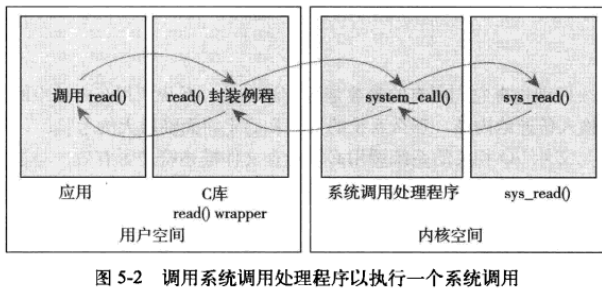

### 5.5 系统调用的实现
#### 5.5.1 实现系统调用
&emsp;系统调用要时刻注意简洁性、可移植性和健壮性。

#### 5.5.2 参数验证
&emsp;系统调用必须仔细检查它们所有的参数是否合法有效。比如PID，文件描述符，以及指针。<br>
&emsp;在老版本的Linux内核中，需要超级用户权限的系统调用才可以通过调用suser()函数这个标准动作来完成检查。新的系统允许检查针对特定资源的特殊权限。使用capable()，如果返回非0，调用者就有权进行操作。
* capable(CAP_SYS_NICE)。是否有权改变其它进程的nice值
* capable(CAP_SYS_BOOT)。

参见<linux/capability.h>，其中包含一份所有这些权能和对应的权限的列表

### 5.6 系统调用上下文
#### 5.6.1 绑定一个系统调用的最后步骤
&emsp;把系统调用注册成为一个正式的系统调用要注意一下几点：
* 1)首先，在系统调用表的最后加入一个表象，从0开始,自动叠加。对于大多数体系机构来说，该表位于entry.s文件中。
* 2)各种体系结构，系统调用号都必须定义于<asm/unistd.h>中
* 3)系统调用必须被编译进内核映像。也就是放在kernel/下的一个相关文件中

系统调用表：
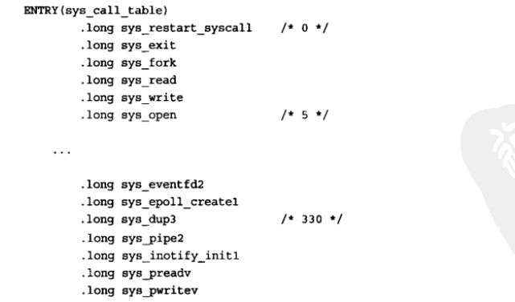

#### 5.6.2 从用户空间访问系统调用
&emsp;通常系统调用靠c库支持。用户程序通过包含标准头文件并和C库连接，就可以使用系统调用。如果只写出系统调用，glibc库并不能提供支持。<br>
&emsp;Linux提供了一组宏，可以用于直接对系统调用进行访问：_syscalln()，n代表需要传递给系统的参数(0-6)。举个例子,open()的系统调用的定义是：
``` c
long open(const char *filename, int flags, int mode);
```
如果不靠库支持：，直接调用系统调用的话：
``` c
# define NR_open 5      //NR_open是定义在<asm/unistd.h>中的系统调用号
_syscall3(long, open, const char *, filename, int, flags, int, mode);
```

#### 5.6.3 为什么不通过系统调用的方式实现
&emsp;建立一个新的系统调用非常容易，但却不能这么做。看一下系统调用作为实现方式的利弊和替代方法：
* 好处
  * 系统调用创建容易且使用方便
  * Linux系统调用的高性能显而易见
* 问题
  * 需要一个系统调用号，这需要官方分配
  * 系统调用加入稳定内核就被固化，为了避免程序崩溃，接口不允许做改动
  * 需要将系统调用注册到各种不同的体系结构中去
  * 在脚本中不容易调用系统调用，也不能从文件系统中直接访问系统调用
  * 由于需要系统调用号，主内核树之外是很难维护的
  * 如果仅仅进行简单信息交换，系统调用就太大材小用了
* 替代方法：
  * 实现一个设备节点，并实现read()和write()。使用ioctl()对特定的设置进行操作或者对特定信息进行检索
  * 像信号量这样的某些接口，可以用文件描述符来表示
  * 把增加的信息作为一个文件放在sysfs的合适位置

## 第六章 内核数据结构
### 6.1 链表
#### 6.1.1 单向链表和双向链表
&emsp;最简单的链表实现方式：

``` c
struct list_element{
  void *data;                   //有效数据
  struct list_element *next;    //指向下一个元素的指针
}
```
&emsp;最简单的双向链表实现方式：
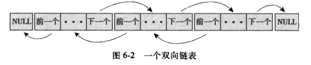
``` c
struct list_element{
  void *data;                   //有效数据
  struct list_element *next;    //指向下一个元素的指针
  struct list_element *pre;    //指向下一个元素的指针
}
```
#### 6.1.2 环形链表
&emsp;首尾相连的链表叫做环形链表。常用场景：
#### 6.1.3 沿链表移动
* 线性移动。适合动态插入和删除数据
* 头指针。首元素会用一个特殊指针表示，称为头指针，可以方便、快速地找到链表的“起始端”

#### 6.1.4 Linux内核中的实现
&emsp;Linux内核实现链表的方式与众不同，它不是将数据结构塞入链表，而是将链表塞入数据结构。链表代码，位于<linux/list.h>中
#### 1 链表数据结构
``` c
struct list_head{
  struct list_head *next;
  struct list_head *prev;
};
struct fox{
  unsigned long tail_length;   //尾巴长度，以厘米为单位
  unsigned long weight;    //重量
  bool is_fantastic   //
  struct list_head list;
}
```
&emsp;使用container_of()可以很方便地从链表指针找到父结构中包含的任何变量。因为C语言中，一个给定结构中的变量偏移在编译时就被ABI固定下来了。<br>
``` c
#define container_of(ptr, type, member) ({const typeof(((type *)0)->member) * _mptr = (ptr);(type *)((char *)_mptr)-offsetof(type,member));})

#define list_entry(ptr, type, member) container_of(ptr, type, member)
```
&emsp;依靠list_entry()方法，内核提供了创建、操作以及其他链表管理的各种例程。所有这些方法都不需要知道list_head所嵌入对象的数据结构。
#### 6.1.5 操作链表
##### 1) 向链表增加一个节点
``` c
list_add(struct list_head *new, struct list_head *head);
```
该函数向指定链表的head节点后插入new节点，因为链表是循环的，没有首尾节点的概念，所以任何一个节点都可以当成head。<br>
``` c
list_add_tail(struct list_head *new, struct list_head *head);
```
该函数向指定链表的head节点前插入new节点。<br>
##### 2)从链表中删除一个节点
``` c
list_del(struct list_head *entry);
```
该函数并不会释放entry或释放包含entry的数据结构体所占用的内存。<br>
##### 3)移动和合并链表节点
``` c
list_move(struct list_head *list, struct list_head *head);
```
把函数从一个链表中移除list项，然后将其加入另一链表的head节点后面。<br>
``` c
list_move_tail(struct list_head *list, struct list_head *head);
```
和函数list_move_tail()一样，唯一不同的是把list项插入到head项前。<br>
``` c
list_empty(struct list_head *head); //检查链表是否为空
list_splice(struct list_head *list, struct list_head *head); //把两个未连接的链表合并在一起，并重新初始化原来的链表
list_splice_init(struct list_head *list, struct list_head *head);//和list_splice()一样，不过list指向的链表要被重新初始化。
```

#### 6.1.6 遍历链表
##### 1)基本方法
遍历链表最简单的方法是使用list_for_each()宏。该宏使用两个list_head类型的参数。仅仅获得list_head指针是不够的，需要知道被嵌入的结构体，如下所示：
``` c
struct list_head *p;
struct fox *f;      //临时变量
list_for_each(p, &fox_list){  //遍历
  f = list_entry(p, struct fox, list);
}
```
##### 2)可用的方法
第一种方法不够优美也不够灵活，多数内核采用list_for_each_entry()宏遍历链表，内部使用了list_entry()宏，可以简化遍历操作：
``` c
list_for_each_entry(pos, head, member);
```
这里pos是一个指向包含list_head的结构的指针，head是指向头结点的指针，member是list_head在结构中的变量名。<br>
##### 3)反向遍历链表
和list_for_each_entry()类似，不过是反向遍历：
``` c
list_for_each_entry_reverse(pos, head, member);
```
##### 4)遍历的同时删除
开发人员会存储一个变量，以便可以安全删除当前项，也就是next或prec：
``` c
list_for_each_entry_save(pos, next, head, member);
```
### 6.2 队列
&emsp;内核通用队列称为kfifo，在文件<kernel/kfifo.c>中，声明在<kernel.kfifo.h>中。
#### 6.2.1 kfifo
kfifo和其它队列实现类似，提供两个主要操作enqueue和dequeue。维护两个偏移量：入口偏移和出口偏移。

####６.2.2 创建队列
动态方法创建和初始化一个大小为size（为2的幂）的kfifo，内核使用gfp_mask标识分配队列，如果创建成功，返回0，错误的话，返回一个错误码：
``` c
int kfifo_alloc(struct kfifo *fifo, unsigned int size, gfp_t gfp_mask);
```
也可以自己分配缓冲，size必须是2的幂，调用：
``` c
int kfifo_init(struct kfifo *fifo, void *buffer, unsigned int size);
```
静态声明kfifo更简单，但不是很常用：
``` c
DEClARE_KFIFO(name, size);
INIT_FIFO(name);
```

#### 6.2.3 推入队列数据
``` c
unsigned int kfifo_in(struct kfifo *fifo, const void *from, unsigned int len);
```
该函数把from指针所指的len字节数据拷贝到fifo队列中，并返回写入的字节数。如果队列剩余空间不足len，返回值可能会小于len，甚至返回0，因为没有任何数据被推入。

#### 6.2.4 摘取队列数据
摘取数据存入to中，返回取出的字节数，并在队列中删除该项：
``` c
unsigned int kfifo_out(struct kfifo *fifo, void *to, unsigned int len);
```
只摘取数据，不删除，offset指向队列中的索引位置：
``` c
unsigned int kfifo_out_peek(struct kfifo *fifo, void *to, unsigned int len, unsigned offset);
```

#### 6.2.5 获取队列长度
获取kfifo队列空间的总体大小，kfifo_size():
``` c
static inline unsigned int kfifo_size(struct kfifo *fifo);
```
返回队列中已推入的数据大小：
``` c
static inline unsigned int kfifo_len(struct kfifo *fifo);
```
获取kfifo队列中还有多少可用空间，则要调用：
``` c
static inline unsigned int kfifo_avail(struct kfifo *fifo);
```
判断kfifo队列是否为空或者满：
``` c
static inline int kfifo_is_empty(struct kfifo *fifo);
static inline int kfifo_is_full(struct kfifo *fifo);
```

#### 6.2.6 重置和撤销队列
重置kfifo，抛弃队列中的内容：
``` c
static inline void kfifo_reset(struct kfifo *fifo);
```
撤销一个使用kfifo_alloc()分配的队列，调用kfifo_free()：
``` c
void kfifo_free(struct kfifo *fifo);
```

### 6.3 映射
&emsp;一个映射，也叫做关联数组，其实是由唯一键值组成的继承，键到值得关联关系称为映射。映射至少要支持三个操作：
* Add(key, value)
* Remove(key)
* value = Lookup(key)

并非所有映射都需要通过散列表实现，除了使用散列表外，还可以使用自平衡二叉树：
* 散列表。更好的平均渐进复杂度。
* 二叉搜索树。在最坏的情况下能有最好的表现。

Linux内核提供了简单、有效的哇映射数据结构，但是它并非一个通用的映射：它映射唯一的标识数(UID)到一个指针。

#### 6.3.1 初始化一个dir
先静态定义或动态分配一个idr数据结构。然后调用idr_init():
``` c
struct idr id_huh;  //静态定义idr结构
idr_init(&id_huh);
```
#### 6.3.2 分配一个新的UID
建立了idr之后，第一步需要高数idr你需要分配新的UID，允许其在必要时调整后备树的大小。第二部才是真正请求UID
``` c
int idr_pre_get(struct idr *idp, gfp_t gfp_mask); //注意：成功时返回1，失败返回0
int idr_get_new(struct idr *idp, void *ptr, int *id); //实际执行获取新的UID，并将其加到idr
```
#### 6.3.3 查找UID
``` c
void *idr_find(struct idr *idp, int id);
```
#### 6.3.4 删除UID
``` c
void idr_remove(struct idr *idp, int id);
```
#### 6.3.5 撤销UID
``` c
void idr_destroy(struct idr *idp); //只会释放idr中未使用的内存
void idr_remove_all(struct idr *idp); //强制删除所有UID
```

### 6.4 二叉树
#### 6.4.1 二叉搜索树
一个二叉树是一个节点有序的二叉树，其顺序通常遵循下列法则：
* 根的左分支节点值都小于跟节点值
* 右分支节点值都大于跟节点值
* 所有的子树也都是二叉搜索树

#### 6.4.2 自平衡二叉树
一个平衡二叉树是一个所有叶子节点深度差不超过1的二叉搜索树。一个自平衡二叉树搜索树是指其操作都视图维持(半)平衡的二叉搜索树。
##### 1. 红黑树
红黑树是一种自平衡二叉搜索树。Linux主要的平衡二叉树结构就是红黑树。红黑树具有特殊的着色属性，或红色或者黑色，并遵循下面六个属性：
* 所有的节点要么着色，要么着黑色。
* 叶子节点都是黑色。
* 叶子节点不包含数据。
* 所有非叶子节点都是两个子节点。
* 如果一个节点是红色，则它的子节点都是黑色。
* 在一个节点到其叶子节点，如果总是包含同样数目的黑色节点，则该路径相比其他路径是最短的。

##### 2. rbtree
Linux实现的红黑树称为rbtree，其定义在文件<lib/rbtree.c>中。Linux的rbtree类似于前面所描述的经典红黑树，即保持了平衡性，所以插入效率和树中节点数目呈对数关系。<br>
创建一个rbtree，需要分配一个新的rb_root结构，并初始化为特殊值RB_ROOT
``` c
struct rb_root root = RB_ROOT;
```
### 6.5 数据结构以及选择
### 6.6 算法复杂度
## 第七章 中断和中断处理
### 7.1 中断
中断使得硬件可以发送通知给处理器。中断本质上是一种电信号。处理器接受到中断之后，会马上向操作系统反应此信号，操作系统就可以对这个中断进行适当的处理。<br>
不同的设备对应唯一的数字标识，这些中断值通常被称为中断请求(IRQ)线。<br>
异常(由处理器本身产生的同步中断)在产生时必须考虑与处理器的时钟同步。比如编程失误导致的错误指令，或执行期间出现的缺页情况。<br>

### 7.2 中断处理程序
&emsp;在响应一个特定中断的时候，内核会执行一个函数，该函数叫做中断处理程序(interrupt handler)或中断服务例程(interrupt service routine, ISR)。中断程序是设备驱动程序的一部分-设备驱动程序是对设备进行管理的内核代码。
<br>
&emsp;在linux中，中断程序必须按照特定的类型声明，以便内核能够以标准的方式传递处理程序的信息。中断处理器程序要完成大量的工作，比如：
* 通知硬件已经接收到中断请求
* 拷贝数据

### 7.3 上半部与下半部的对比
&emsp;为了保证中断处理程序响应得快，又要中断处理程序完成的工作量更多。一般会把中断处理切为两个部分。
* 上半部。接受一个中断，它就立即执行，一般是需要严格时间要求的工作，比如对接受的中断进行应答或者复位硬件。
* 下半部。一般是允许稍后完成的工作。

### 7.4 注册中断处理程序
驱动程序可以通过request_irq()函数注册一个中断程序，在<linux/interrupt.h>中，并且激活给定的中断线，以处理中断：
``` c
typedef irqreturn_t (*irq_handler_t)(int, void*);

int request_irq(unsigned int irq,   //要分配的中断号
                irq_handler_t handler, //指向处理这个中断的中断处理程序
                unsigned long flags,
                const char *name,
                void *dev);
```
#### 7.4.1 中断处理程序标志
第三个参数可以为0，也可以是下列一个或多个标志的位掩码。其定义在文件<linux/interrupt.h>。其中比较重要的有：
* IRQ_DISABLED。在内核处理中断程序本身期间，禁止其他所有中断
* IRQF_SAMPLE_RANDOM。此标志标明这个设备产生的中断对内核熵池(entropy pool)有贡献。内核熵池负责提供从各种随机事件导出的真正随机数。
* IRQ_TIMER。系统定时器的中断处理标志
* IRQF_SHARED。表明可以在多个处理程序之间共享中断线。

第四个参数name是与中断相关的设备的ASCALL文本表示。例如键盘中断对应的值为"keyboard"。这些名字会被/proc/irq和proc/interrupts文件使用。以便与用户通信。<br>

第五个参数dev用于共享中断线。当一个中断处理程序需要释放时，dev将提供唯一的标志信息(cookie)，以便从共享中断线的诸多中断处理程序中删除指定的那一个。

#### 7.4.2 一个中断例子

#### 7.4.3 释放中断处理程序
&emsp;下载驱动程序时，需要注销相应的中断处理程序，并释放中断线。调用
``` c
void free_irq(unsigned int irq, void *dev);
```

### 7.5 编写中断处理程序
中断处理程序声明:
``` c
static irqreturn_t intr_handler(int irq, void *dev);
```
第一个参数是中断号，第二个参数是dev和传给request_irq()中的一样。<br>
**重入和中断处理程序**
&emsp;Linux中的中断处理程序是无须重入的。当一个给定的中断处理程序正在执行时，相应的中断线在左右处理器上都会被屏蔽掉，以防止同一中断线上接受另一个新的中断。

#### 7.5.1 共享的中断处理程序
共享中断处理程序有几点不同：
* request_irq()的参数flags必须设置IRQF_SHARED标志
* 对于每个注册的中断处理程序来说，dev必须唯一
* 中断处理程序必须能够区分它的设备是否真的产生了中断。这即需要硬件的支持，也需要处理程序中有关的处理逻辑。

#### 7.5.2 中断处理程序实例
让我们考察一个时间的中断处理程序，来自real-time clock(RTC)驱动程序，可以在<drivers/char/rtc.c>中找到。用于设置系统时钟，提供报警器或周期性的定时器。<br>
RTC驱动程序装载时，rtc_init()函数会被调用，进行驱动程序初始化，其中之一就是注册中断处理程序。
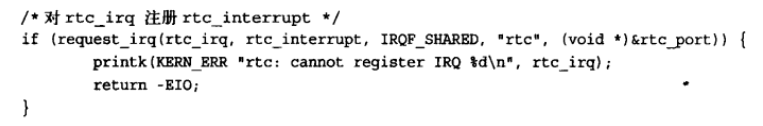
然后就是中断处理程序本身：
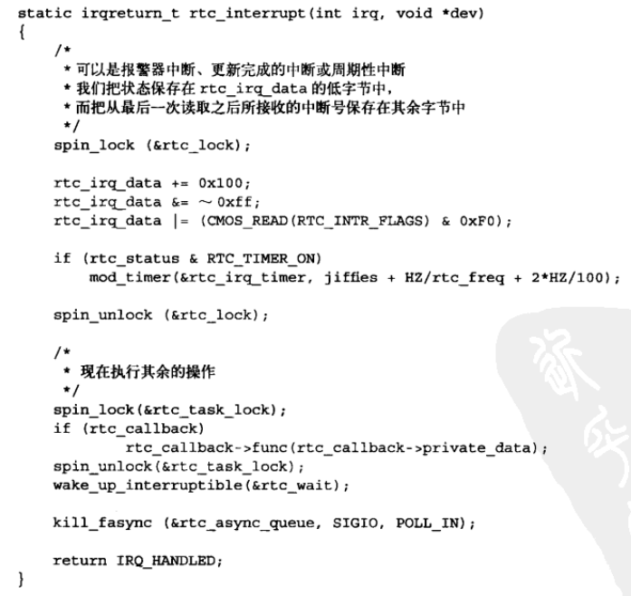
该中断处理程序中使用了自旋锁：第一次调用是为了保证rtc_irq_data不被SMP机器上的其他处理器同时访问，第二次调用避免rtc_callback出现相同的情况。

#### 7.6 中断上下文
* 中断上下文不可以睡眠，不能从中断上下文中调用某些函数
* 中断上下文具有较为严格的时间限制，中断上下文的代码应当迅速、简洁。
* 中断处理程序栈的设置是一个配置选项

#### 7.7 中断处理机制的实现
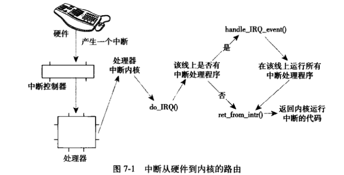
**中断从硬件到内核的路由**  <br>
设备产生中断，通过总线把电信号发送给中断控制器。如果中断线是激活的，那么中断控制器会把中断发送给处理器。处理器立即停止正在做的事情，并关闭中断系统，然后跳到内存中预定义的位置开始执行那里的代码。<br>
**在内核中** <br>
内核接收到中断的IRQ号。在初始入口点保存这个号，并存放当前寄存器的值(属于被中断的任务)。然后内核调用do_IRQ()函数：
``` c
unsigned in do_IRQ(struct pt_regs regs);
```
doIRQ()对接受的中断进行应答，禁止这条线上的中断传递。然后调用handle_IRQ_event()函数运行为这条中断线所安装的中断处理程序。handle_IRQ_event()方法被定义在<kernel/irq/handler.c>中：
``` c
irqreturn_t handle_IRQ_event(unsigned int irq, struct irqaction *action)
```
然后回到do_TRQ()，该函数做清理工作并返回到初始入口点，然后从这个入口点跳到函数ret_from_intr()。这个函数检查重新调度是否正在挂起(意味着是否设置了need_resched)。<br>

### 7.8 /proc/interrupts
proicfs是一个虚拟文件系统，它只存在与内核内存，一般安装于/proc目录。在procfs中读写文件都要调用内核函数，这些函数模拟从真实文件中读或写。/proc/interrupts文件中存放的是系统中与中断相关的统计信息。下面是从单处理器PC上输出的信息。
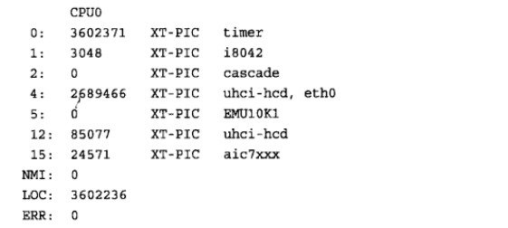
* 第一列是中断线
* 第二列是接受中断数目计数器
* 第三列是处理这个中断的中断控制器
* 第四列是与这个中断相关的设备名字。通过参数devname提供给request_irq()函数。

### 7.9 中断控制
linux内核提供了一组接口用于操作机器上的中断状态。这些接口能禁止当前处理器的中断系统，或者屏蔽掉整个机器的中断线。在<asm/system.h>和<asm/irq.h>中可以找到。
* 锁。防止其它处理器对共享数据的并发访问
* 禁止中断。防止其它中断处理程序的并发访问、

#### 7.9.1 禁止和激活中断
禁止**当前处理器**以及激活它们的中断语句为：
``` c
local_irq_disable();  //禁止
local_irq_enable();   //激活
```
除了禁止和激活之外，我们还需要一种机制把中断恢复到以前的状态。Linux在禁止中断之前会保存中断系统的状态。下面这两个函数必须在同一个函数中进行。
``` c
unsigned long flags;
local_irq_save(flags); //禁止中断
local_irq_restore(flags);  //中断被恢复
```

#### 7.9.2 禁止指定中断线
在某些情况下，只禁止系统中一条特定的中断线就够了。Linux提供了四个接口：
``` c
void disable_irq(unsigned int irq);  //等所有处理程序运行完再返回
void disable_irq_nosync(unsigned int irq); //不等处理程序运行完就返回
void enable_irq(unsigned int irq);
void synchronize_irq(unsigned int irq); //等待一个特定中断处理程序的退出
```

#### 7.9.3 中断系统的状态
在<asm/system.h>中:<br>
* 宏irqs_disable()。中断系统被禁止返回非0，否则返回0

在<linux/hardirq.h>中:  <br>
* in_interrupt()。内核正在执行中断程序或在执行下半部处理程序时，返回非0
* in_irq()。执行中断程序时返回非0，不包括下半部分。

下表是中断控制方法和其描述的摘要<br>
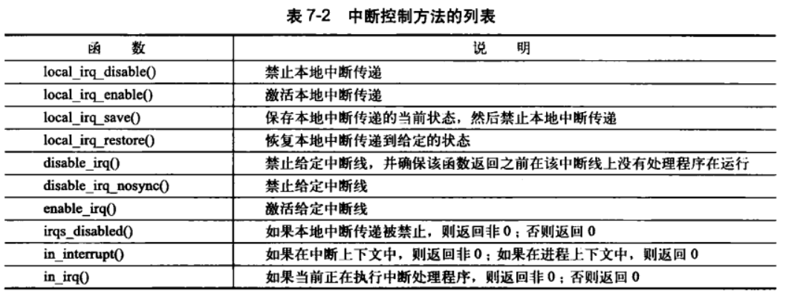

## 第八章 下半部和推后执行的工作

## 第九章 内核同步介绍

## 第十章 内核同步方法
### 10.1 原子操作
### 10.2 自旋锁
### 10.3 读写锁
### 10.4 信号量
### 10.5 读-写信号量
### 10.6 互斥体
### 10.7 完成变量
### 10.8 BLK:打内核锁
### 10.9 顺序锁
### 10.10 禁止抢占
### 10.11 顺序和屏障

## 第十一章 定时器和时间管理
## 第十二章 内存管理
## 第十三章 虚拟文件系统
## 第十四章 块I/O层
## 第十五章 进程地址空间
## 第十六章 页高速缓存和页回写
## 第十七章 设备与模块
## 第十八章 调试
## 第十九章 可移植性
## 第二十章 补丁、开发和社区
---
## 哔哩哔哩-编程开发linux内核探秘
### 内核编译
* 编译的实质
  *
