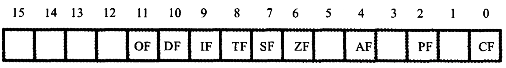
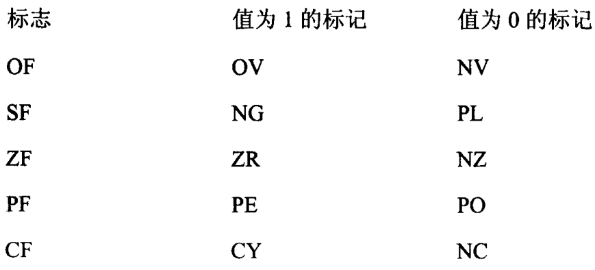
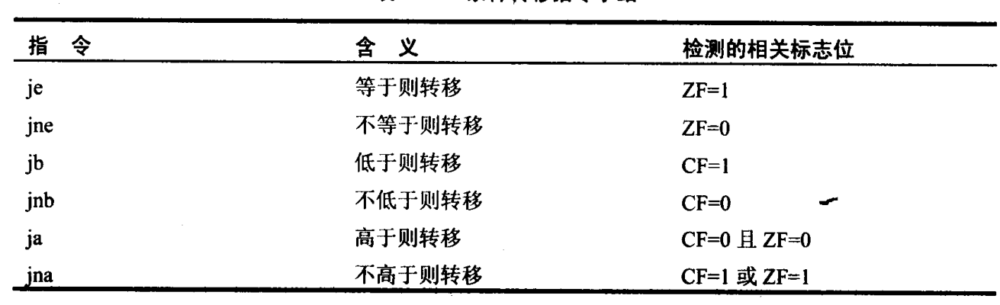
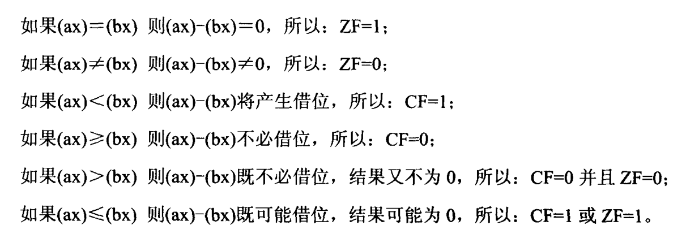
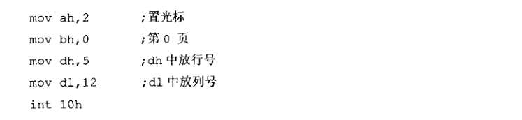
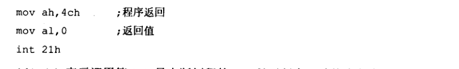

# 80086汇编介绍
## 第一章 寄存器介绍
8086CPU的所有寄存器都是16位的，可以存放2个字节。
### 通用寄存器
* AX
* BX     默认和DS配合，相当于偏移，mov ax,[bx]。
* CX
* DX
### 段寄存器
* CS     代码段寄存器，不能通过立即数修改
* DS     数据段寄存器
* SS     栈段寄存器，一般和SP和BP配合
* ES      额外寄存器

* IP      指令指针寄存器，和CS配合
* SP     和SS配合，表示栈顶的地址
* BP     默认和SS配合，如mov ax,[bp]，表示ss:bp
* SI     默认和DS配合，和bx功能相近的寄存器，不能分成两个8位寄存器
* DI     默认和ES配合，和bx功能相近的寄存器，不能分成两个8位寄存器

### 标志寄存器 flag
 <br>
* ZF       第6位，零标志位。如果相关指令(mov, sub, and, or)的结果为0，则ZF为1.
* PF       第二位，奇偶标志位。如果相关指令的结果中二进制个数为偶数，则PF=1。
* SF       第七位，符号标志位。记录相关指令执行过后，结果是否为负，负的话则SF=1
* CF       第0位，进位标志位。无符号运算时，记录最高有效位向更高位的进位值，或更高位的借位值
* OF       有符号运算时，产生溢出问题。
* DF       第10位，方向标志位。在串春丽指令中，控制每次si,di的增减。DF=0，每次操作后si,di递减；DF=1，每次操作后si,di递增
* TF       第8位。如果TF为1则产生单步中断，中断类型码为1。
* IF       第9位。可屏蔽中断设置，当IF=1时，CPU相应科屏蔽中断，否则不响应

标志寄存器在Debug中的表示：
   <br>
  <br>

## 第二章 指令介绍
### word ptr   指定访问的内存单元是一个字单元
mov word ptr ds:[0],1
add word ptr [bx],2

### byte ptr  指定访问的内存单元是一个字节单元
inc byte ptr [bx]

### DUP   定义重复数据
db 3 dup (0)       定义三个字节(0,0,0)
db 3 dup (0,1,2)  定义9个字节(0,1,2,0,1,2,0,1,2)

### DIV
除数：有8位和16位两种，在一个寄存器或者内存单元中
被除数：默认放在AX或者DX和AX中。如果除数为8位，被除数16位，默认在AX中存放。如果除数为16位，被除数为32位，在DX和AX中存放。
结果：如果除数为8位，AL存商，AH存余数。如果被除数是32位，AX存商，DX存余数

### PUSH
push ax       将AX入栈

### PUSHF      将标志寄存器的值压栈

### POP
pop [0]        将栈顶元素出栈，并存放在DS:0中

### POPF      从栈中弹出一个字的数据并送入标志寄存器

### OFFSET   由编译器处理，取标号的偏移地址

### LOOP
进行两步操作：loop 标号
* (1)  (cx)=(cx)-1
* (2)  cx为0则向下执行，不为0则跳转标号所在的位置

### JMP   无条件转移指令
* jmp 2AE3:3                 同时修改CS和IP
* jmp ax                         只修改IP
* jmp word ptr ds:[0]    IP存在指定内存单元中，一个字
* jmp dword ptr ds:[0]  IP存在指定内存单元中，两个字
* jmp short 标号             段内短转移，对IP的修改范围为-128~127，转移到标号处执行指令
* jmp  near ptr 标号       段内近转移，16位修改，-32768~32767
* jmp far ptr 标号           段间转移，又称远转移

### JNC 条件转移指令
当CF等于0时跳转

### CALL
两步操作：
(1)  将当前的IP或CS和IP压入栈中
(2)  转移
call 标号。相当于：
push IP
jmp near ptr 标号
call far ptr 标号。相当于：
push CS
push IP
jmp far ptr 标号
call 寄存器。相当于：
push IP
jmp 16位寄存器
call word ptr 内存单元地址。

### RET   用栈中的数据，修改IP内容，实现近转移
相当于：
pop IP

### RETF   用栈中的数据，修改CS和IP内容，实现远转移
相当于：
pop IP
pop CS

### 比较转移指令。常用的比较转移指令小结：


### JCXZ     有条件转移指令（所有条件转移指令都是短转移）
如果cx=0     则跳到标号处执行
乳沟cx!=0    继续向下执行

### MOV
mov bx,1000H   向BX寄存器写入1000H
mov al,[0]          向al中写入DS:0代表的值
mov ah,es:[0]     像ah中写入es:0中存储的值
mov cs:[bx],al

### CMP    比较指令
cmp指令相当于减法指令，只是不保存结果，仅仅根据计算结果对标志寄存器进行设置。有符号和无符号的情况下是不相同的
那么将会有以下几种关系：


### TEST
该指令将两个操作数进行与操作，但不影响操作数本身的数值，结果为0则ZF=1，否则ZF=0，该指令常用于检测某个寄存器是否为空
test ax,

### AND     逻辑与指令，按位
and al,01111111B   可以将al最高位置0，其它不变

### OR     逻辑或指令，按位
or al,10000000B   可以将al最高位置1，其它不变

### XOR    异或指令
xor bh,bh    将bh置0

### INC   加1

### ADD  加法指令
如果两个操作数都是16位，那么结果存放在前面的操作数。如果两个操作数都为16位，那么低16为存放在AX，高16位存放在DX。
add ax,bx          也就是(ax)=(ax)+(bx)

### ADC    带进位加法指令
add ax,bx        相当于(ax)=(ax)+(bx)+CF

### SUB   减法指令
sub bx,[2]       bx-ds:2中的值

### SBB   带借位减法指令
sbb  ax,bx      实现的功能是(ax)=(ax)-(bx)-CF

### MUL    乘法指令  
(1) 乘数。两个乘数都是8位，一位默认放在AH中，另一个放在8位寄存器或内存字节单元中。如果16位，一个默认在AX中，另一个放在16位寄存器或内存字单元中，
(2)结果。8位乘法，结果默认在AX中。16位乘法，高位DX中，低位AX中。

### MOVESB    串传送指令
movsb 相当于：
``` text
(1) ((es)*16+(di)))=((ds)*16+(si))   传送一个字节
(2) 如果DF=0:     (si)=(si)+1  (di)=(di)+1
movsw  同理，只不过si,di增减的数目为2
```

### REP    根据cx的值重复执行一个指令
rep  movsb:
相当于：
s:movsb     不断传送字节，直到CX=0，由DF控制di和si的方向
   loop s

### CLD    将标志寄存器的DF位置0

### STD    将标志寄存器的DF位置1

### STI   设置IF=1

### CLI   设置IF=0

### SHI  左移指令
将一个寄存器或内存单元按照二进制向左移位，将最后移出的写入CF中，最低位用0补充。

### SHR  右移指令
将一个寄存器或内存单元按照二进制向右移位，将最后移出的写入CF中，最低位用0补充。

### IN   端口读指令
只能只用ax和al来存放从端口中读入的数据
in al,20h    从20h中读取一个byte的数据
in al,dx      从dx寄存器存储的端口号中读取一个字节

### OUT 端口写指令
只能只用ax和al来存放写入端口的数据
out 20h,al
out dx,al

### SEG
指明下一句代码的段地址寄存器，该命令只能影响下一句，适合不想使用默认段寄存器的时候，seg指令只会影响数据寄存器（目前知道的有bx）的段地址信息，不会影响索引寄存器（si和di）的段地址信息，如：
seg fs
mov si,(bx)  
bx默认和DS配合，但这里指定了fs的地址，也就是将fs:bx指定的内容付给ds:si

## 第三章 小知识点
伪指令
assume cs:XXX       关联
XXX segment
.
XXX ends            ends和end不一样，end是结束编译的标志

标号
除了汇编指令和伪指令外，还有以下标号。比如XXX segment的XXX就是一个标号，一个标号指代了一个地址。

程序返回
mov  ax,4c00H
int   21H

操作系统的外壳
操作系统是由多个功能模块组成的庞大、复杂的团建系统。任何通用的操作系统，都要提供一个称为shell(外壳)的程序，用户（操作人员）使用这个程序来操作计算机系统进行工作。DOS的command.com负责将可执行文件加入内存，并设置CS:IP指向程序的入口。运行完之后，退回到外壳。

PSP
DOS系统中加载在某一段可内存加载可执行程序之前，要在前面加上PSP，一共256个字节，用于和被加载程序的通信。比如
空闲内存区    SA:0
PSP区           SA:0
程序区          SA+10H:0

end START
程序入口，一般指向CS:IP，是程序的第一条指令，我们要想让程序从哪里开始执行，只要使用end指明就可以了。注：CS:0指向的也可能是代码段开始定义的数据，但CS:IP指向的一定是第一条执行的代码

db     define byte 定义字节型数据
dw     define word  定义字型数据
ds      define double  定义双子型数据

16位结构的CPU
运算器一次最多可以处理16位数据
寄存器的最大宽度为16位
寄存器和运算器之间的通路为16位

调试方法
DEBUG命令
R      查看、改变CPU寄存器的内容
D      查看内存中的内容。d 段地址:偏移地址。给定地址后的128个内存单元
E       改写内存中的内容
U      将内存中的机器指令翻译成汇编指令
T      执行一条机器指令
A     以汇编指令在内存中写入一条机器指令

## 端口
各种存储器都和CPU的地址线、数据线、控制线相连。CPU把它们当做内存来对待，把它们总的看做一个由若干存储单元组成的逻辑存储器，这个逻辑存储器称为内存地址空间
除存储器外，和CPU通过总线相连的芯片还有以下三种芯片：
(1)  各种接口卡（网卡，显卡）上的接口芯片，控制接口卡进行工作
(2)  主板上的接口芯片，CPU通过它们对部分外设进行访问
(3)  其它芯片，用来存储相关的系统信息，或进行相关的输入输出处理
在这些芯片中，都有一组可以由CPU读写的寄存器。这些寄存器，它们在物理上可能处于不同的芯片，但是它们有一下两点相同：
(1)  都和CPU的总线相连，当然这种连接是通过它们所在的芯片进行的
(2) CPU对他们进行读或者写的时候都通过控制线向它们所在的芯片发送端口读写命令。
从CPU的角度来说，将这些寄存器当做端口，并对它们进行统一编址，从而建立一个端口地址空间，每个端口都有一个地址空间。CPU可以直接读写的地方：
(1) CPU内部寄存器
(2) 内存单元
(3) 端口
### 访问CMOS RAM中存储的时间以及配置信息。该RAM一共有126个字节，有6个字存放时间。
从CMOS RAM的8号单元读出当前月份的BCD码
mov al,8
out 70h,al
in al,71h

## 中断
### 内中断
#### 中断的产生
(1) 除法错误。类型码：0
(2) 单步执行。类型码：1
(3) 执行int0指令。类型码：4
(4) 执行int指令。指令格式为int n。指令中的n为字节型立即数，是提供给CPU的中断类型码。

#### 中断向量表
8086在内存0000:0000-0000:03EB的1000个存储单元中，一共存放了256个中断源对应的中断处理程序入口（段地址和偏移地址）。一个中断项占用两个字，高地址存放段地址，低地址字段存放偏移地址。

#### 中断过程
下面是8086cpu在收到中断信息后，所引发的中断过程
(1) 从中断信息中取得中断类型码
(2) 标志寄存器的值入栈；（因为在中断过程中要改变标志寄存器的值，所以先将其保存在栈中）。
(3) 设置标志寄存器的第8位TF和第9位IF的值为0；
(4) CS的内容入栈。
(5) IP的内容入栈
(6) 从内存地址为中断类型码*4和中断类型码*4+2的两个字单元中读取中断处理程序的入口地址设置IP和CS。

#### 显示
要让屏幕显示字符，其实就是要将字符写入显存空间。参数ax为显存空间的段地址，参数di为显存空间的偏移地址

#### 响应中断的特殊情况
一般情况下，CPU在执行完当前指令后，如果检测到中断信息，就响应中断。可是有些情况即便发生中断，也不会响应。比如在改变ss寄存器后，不会响应中断。原因就是ss以及ip需要一起修改的，否则当中断返回时就会出现错误。

#### BIOS和DOS
系统版的ROM中存放一套程序，称为BIOS(基本输入输出系统），BIOS中主要包含以下几部分内容：
(1) 硬件系统的检测和初始化程序
(2)  外部中断和内部中断的中断例程
(3)  用于对硬件设备进行I/O操作的中断例程
(4) 其他和硬件系统相关的中断例程
操作系统DOS也提供了中断例程，DOS的中断例程就是操作系统向程序员提供的编程资源，和硬件相关的DOS中断例程中，一般都调用了BIOS的中断例程。

#### BIOS和DOS在中断例程的安装过程
(1) CPU加电后，初始化(cs)=0FFFFH，(ip)=0，自动从FFFF:0单元开始执行程序，然后跳转去执行BIOS的硬件系统检测和初始化程序
(2) 初始化程序将简历BIOS所支持的中断向量，将BIOS提供的中断例程地址登记在中断向量表中。BIOS提供的中断例程固化到了ROM中，一直存在，所以只需要登记地址就可以了
(3) 硬件系统检测和初始化完成后，调用int 19h进行操作系统的引导。从此计算机交由操作系统控制
(4) DOS启动后，除去完成其他工作外，还将它所提供的中断例程装入内存，并建立登记相应的中断向量

#### int 10h中断
int 10h包含了多个和屏幕输出相关的子程序。中断例程一般包括多个子程序，一般使用ah来传递内部子程序编号，比如：


#### int 21h中断
int 21h是DOS提供的中断例程，在光标位置显示字符串(ah=9)，可以当做程序返回功能：


### 外中断
#### 可屏蔽中断
可屏蔽中断是CPU可以不响应的外中断。CPU是否响应需要查看寄存器IF的设置，IF=1时，CPU在执行完当前指令后响应中断，引发中断过程。可屏蔽中断的过程除了第一步基本和内中断类似，可屏蔽中断信息来自于CPU外部，中断类型吗是通过数据总线送到CPU的。

#### 不可屏蔽中断
不可屏蔽中断是CPU必须响应的外中断，中断类型码，固定为2，所以不需要取中断类型码当CPU检测到不可屏蔽信息时，则在执行完当前指令后立即响应，引发中断过程。

#### PC键盘处理过程
键盘上的每一个键相当于一个开关，键盘中有一个芯片对键盘上的每个开关状态进行扫描。按下或者松开键盘，都会产生扫描码。一般来说按下一个键时产生的扫描码称为通码，松开一个键产生的扫描码称为断码。
断码=通码+80H

#### 引发9号中断
键盘的输入到达60H端口时，相关的芯片就会向CPU发出中断类型为9的可屏蔽中断信息。CPU检测该中断信息后，如果IF=1，则相应中断

#### 执行int 9中断例程
(1) 读出60H端口的扫描码
(2) 如果是字符键的扫描码，将该扫描码和它所对应的ASCLL码送入内存BIOS键盘缓冲区；如果是控制键（比如Ctrl）和切换键（CapsLock）的扫描码，则将其转变为状态字节（用二进制位记录控制键和切换键状态的字节）写入内存存储状态字节的单元。
(3) 对键盘系统进行相关的控制，比如说，向相关芯片发出应答信息。

0040:17单元存储键盘状态字节，该字节描述如下：

